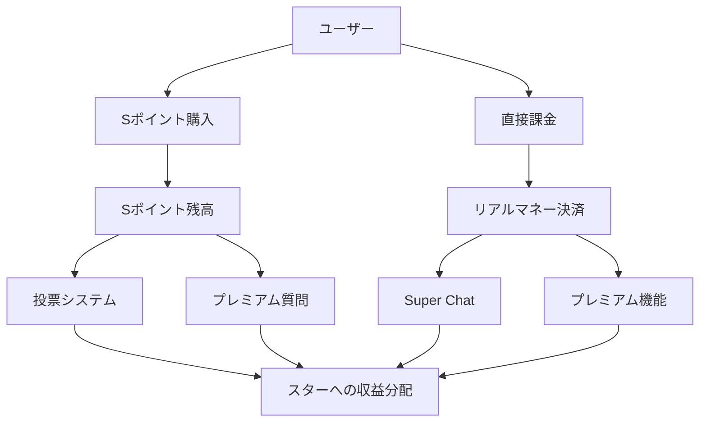

# 決済システム統合戦略 - Starlistプラットフォーム

## 概要
Starlistプラットフォームにおける包括的な決済システム統合計画。Sポイント（仮想通貨）と実際の金銭決済を組み合わせたハイブリッドエコノミーシステムの構築戦略です。

## 現在の実装状況

### ✅ 既存システム
1. **Sポイントシステム**: 投票、プレミアム質問、Super Chatで使用
2. **Super Chatシステム**: YouTube風の課金システム（5段階ティア）
3. **自動返金機能**: プレミアム質問の期限切れ時の自動処理
4. **リアルタイム決済**: Supabase関数による即座の処理

## 決済統合アーキテクチャ

### 1. 🎯 ハイブリッド決済モデル



### 2. 💰 決済プロバイダー統合計画

#### 段階的導入アプローチ
1. **Phase 1**: Stripe統合（クレジットカード決済）
2. **Phase 2**: PayPal統合（グローバル対応）
3. **Phase 3**: Apple Pay / Google Pay（モバイル最適化）
4. **Phase 4**: 仮想通貨決済（Bitcoin, Ethereum）

#### 推奨統合順序
```typescript
// 1. Stripe統合（最優先）
interface StripeIntegration {
  creditCards: string[];  // Visa, Mastercard, AMEX
  subscriptions: boolean;  // 月額プラン対応
  webhooks: boolean;      // 決済状態同期
  jpySupport: boolean;    // 日本円対応
}

// 2. PayPal統合
interface PayPalIntegration {
  oneTimePayments: boolean;
  subscriptions: boolean;
  globalCurrency: string[];  // USD, EUR, JPY
  disputeHandling: boolean;
}
```

## 3. 📊 決済システム設計

### データベース設計拡張

```sql
-- 決済方法テーブル
CREATE TABLE payment_methods (
    id UUID PRIMARY KEY DEFAULT gen_random_uuid(),
    user_id UUID NOT NULL REFERENCES users(id),
    provider_type TEXT NOT NULL CHECK (provider_type IN ('stripe', 'paypal', 'apple_pay', 'google_pay', 'crypto')),
    provider_id TEXT NOT NULL,  -- Stripe customer ID, PayPal account etc.
    is_default BOOLEAN DEFAULT FALSE,
    metadata JSONB DEFAULT '{}',
    created_at TIMESTAMP WITH TIME ZONE DEFAULT NOW(),
    updated_at TIMESTAMP WITH TIME ZONE DEFAULT NOW()
);

-- 決済取引テーブル
CREATE TABLE payment_transactions (
    id UUID PRIMARY KEY DEFAULT gen_random_uuid(),
    user_id UUID NOT NULL REFERENCES users(id),
    payment_method_id UUID REFERENCES payment_methods(id),
    amount_jpy INTEGER NOT NULL,  -- 日本円金額（セント単位）
    amount_usd INTEGER,           -- 米ドル金額（セント単位）
    s_points_purchased INTEGER DEFAULT 0,
    transaction_type TEXT NOT NULL CHECK (transaction_type IN ('s_points_purchase', 'super_chat', 'subscription', 'refund')),
    provider_transaction_id TEXT NOT NULL,  -- Stripe payment intent ID etc.
    status TEXT NOT NULL DEFAULT 'pending' CHECK (status IN ('pending', 'completed', 'failed', 'refunded')),
    metadata JSONB DEFAULT '{}',
    created_at TIMESTAMP WITH TIME ZONE DEFAULT NOW(),
    updated_at TIMESTAMP WITH TIME ZONE DEFAULT NOW()
);

-- サブスクリプションテーブル
CREATE TABLE subscriptions (
    id UUID PRIMARY KEY DEFAULT gen_random_uuid(),
    user_id UUID NOT NULL REFERENCES users(id),
    star_id UUID REFERENCES users(id),  -- 特定スターへのサブスク
    plan_type TEXT NOT NULL CHECK (plan_type IN ('premium_fan', 'star_supporter', 'platform_premium')),
    amount_monthly_jpy INTEGER NOT NULL,
    provider_subscription_id TEXT NOT NULL,
    status TEXT NOT NULL DEFAULT 'active' CHECK (status IN ('active', 'canceled', 'past_due', 'unpaid')),
    current_period_start TIMESTAMP WITH TIME ZONE NOT NULL,
    current_period_end TIMESTAMP WITH TIME ZONE NOT NULL,
    created_at TIMESTAMP WITH TIME ZONE DEFAULT NOW(),
    updated_at TIMESTAMP WITH TIME ZONE DEFAULT NOW()
);

-- 収益分配テーブル
CREATE TABLE revenue_shares (
    id UUID PRIMARY KEY DEFAULT gen_random_uuid(),
    star_id UUID NOT NULL REFERENCES users(id),
    transaction_id UUID NOT NULL REFERENCES payment_transactions(id),
    gross_amount_jpy INTEGER NOT NULL,
    platform_fee_rate DECIMAL(5,2) NOT NULL DEFAULT 30.00,
    platform_fee_jpy INTEGER NOT NULL,
    star_revenue_jpy INTEGER NOT NULL,
    payout_status TEXT NOT NULL DEFAULT 'pending' CHECK (payout_status IN ('pending', 'paid', 'failed')),
    payout_date TIMESTAMP WITH TIME ZONE,
    created_at TIMESTAMP WITH TIME ZONE DEFAULT NOW()
);
```

### 4. 🔄 Sポイント購入システム

#### 価格設定戦略
```typescript
interface SPointPackages {
  basic: {
    sPoints: 1000;
    priceJpy: 120;    // 12円/100SP (1SP = 0.12円)
    priceUsd: 0.99;
  };
  standard: {
    sPoints: 5000;
    priceJpy: 500;    // ボーナス: +400SP
    priceUsd: 4.99;
  };
  premium: {
    sPoints: 12000;
    priceJpy: 1000;   // ボーナス: +2000SP
    priceUsd: 9.99;
  };
  ultimate: {
    sPoints: 30000;
    priceJpy: 2000;   // ボーナス: +8000SP
    priceUsd: 19.99;
  };
}
```

#### 実装関数
```sql
-- Sポイント購入処理関数
CREATE OR REPLACE FUNCTION process_s_point_purchase(
    p_user_id UUID,
    p_package_type TEXT,
    p_payment_transaction_id UUID
)
RETURNS JSONB AS $$
DECLARE
    v_s_points INTEGER;
    v_bonus_points INTEGER := 0;
BEGIN
    -- パッケージタイプに応じてSポイント数を決定
    CASE p_package_type
        WHEN 'basic' THEN v_s_points := 1000;
        WHEN 'standard' THEN 
            v_s_points := 5000;
            v_bonus_points := 400;
        WHEN 'premium' THEN 
            v_s_points := 12000;
            v_bonus_points := 2000;
        WHEN 'ultimate' THEN 
            v_s_points := 30000;
            v_bonus_points := 8000;
        ELSE
            RETURN jsonb_build_object('success', false, 'error', 'Invalid package type');
    END CASE;

    -- Sポイント残高を更新
    UPDATE s_points 
    SET balance = balance + v_s_points,
        total_earned = total_earned + v_s_points,
        updated_at = NOW()
    WHERE user_id = p_user_id;

    -- 取引履歴を記録
    INSERT INTO s_point_transactions (
        user_id, amount, transaction_type, source_type, source_id, description
    ) VALUES (
        p_user_id, v_s_points, 'earned', 'purchase', p_payment_transaction_id,
        format('Sポイント購入 (%s)', p_package_type)
    );

    -- ボーナスポイントがある場合
    IF v_bonus_points > 0 THEN
        UPDATE s_points 
        SET balance = balance + v_bonus_points,
            total_earned = total_earned + v_bonus_points
        WHERE user_id = p_user_id;

        INSERT INTO s_point_transactions (
            user_id, amount, transaction_type, source_type, source_id, description
        ) VALUES (
            p_user_id, v_bonus_points, 'bonus', 'purchase', p_payment_transaction_id,
            format('購入ボーナス (%s)', p_package_type)
        );
    END IF;

    RETURN jsonb_build_object(
        'success', true,
        's_points_added', v_s_points,
        'bonus_points', v_bonus_points,
        'total_added', v_s_points + v_bonus_points
    );
EXCEPTION
    WHEN OTHERS THEN
        RETURN jsonb_build_object('success', false, 'error', SQLERRM);
END;
$$ LANGUAGE plpgsql SECURITY DEFINER;
```

### 5. 💎 サブスクリプションシステム

#### プラン設計
```typescript
interface SubscriptionPlans {
  premiumFan: {
    nameJa: "プレミアムファン";
    priceMonthly: 500;  // 月額500円
    benefits: [
      "月間3000Sポイント付与",
      "プレミアム質問割引50%",
      "限定コンテンツアクセス",
      "広告非表示"
    ];
  };
  starSupporter: {
    nameJa: "スターサポーター";
    priceMonthly: 1000; // 月額1000円
    benefits: [
      "月間7000Sポイント付与",
      "Super Chat割引20%",
      "スター限定配信アクセス",
      "優先サポート"
    ];
  };
  platformPremium: {
    nameJa: "プラットフォームプレミアム";
    priceMonthly: 1500; // 月額1500円
    benefits: [
      "月間12000Sポイント付与",
      "全機能無制限利用",
      "独占コンテンツ",
      "VIPサポート"
    ];
  };
}
```

### 6. 🌐 グローバル決済対応

#### 多通貨サポート
- **主要通貨**: JPY, USD, EUR
- **為替レート**: リアルタイム取得（毎時更新）
- **地域対応**: 日本、北米、ヨーロッパ

#### 法的コンプライアンス
- **日本**: 資金決済法対応
- **EU**: PSD2指令対応  
- **米国**: PCI DSS準拠

### 7. 🔒 セキュリティ戦略

#### 決済セキュリティ
```typescript
interface PaymentSecurity {
  encryption: "AES-256";
  tokenization: true;        // カード情報の非保存
  twoFactorAuth: boolean;   // 高額決済時の2FA
  fraudDetection: boolean;  // 不正取引検知
  webhookVerification: boolean; // Webhook署名検証
}
```

#### 監査とログ
- 全決済取引の完全ログ記録
- 異常パターンの自動検知
- 定期的なセキュリティ監査

### 8. 📈 実装ロードマップ

#### Phase 1: 基盤構築（1-2ヶ月）
- [ ] Stripe統合基盤
- [ ] Sポイント購入システム
- [ ] 基本的な決済UI

#### Phase 2: 機能拡張（2-3ヶ月）
- [ ] サブスクリプションシステム
- [ ] PayPal統合
- [ ] 収益分配システム

#### Phase 3: 最適化（3-4ヶ月）
- [ ] モバイル決済対応
- [ ] 多通貨サポート
- [ ] 高度な分析機能

#### Phase 4: 拡張機能（4-6ヶ月）
- [ ] 仮想通貨対応
- [ ] AI不正検知
- [ ] グローバル展開

### 9. 💼 ビジネスモデル

#### 収益構造
- **Sポイント販売**: 売上の100%（プラットフォーム収益）
- **Super Chat**: 30%手数料（70%をスターに分配）
- **プレミアム質問**: 20%手数料（80%をスターに分配）
- **サブスクリプション**: 売上の100%（プラットフォーム収益）

#### 予想収益
```typescript
interface RevenueProjection {
  month1: {
    sPointSales: 500000;      // 50万円
    superChatCommission: 150000; // 15万円
    subscriptions: 200000;    // 20万円
    total: 850000;           // 85万円
  };
  month6: {
    sPointSales: 2000000;    // 200万円
    superChatCommission: 600000; // 60万円
    subscriptions: 800000;   // 80万円
    total: 3400000;         // 340万円
  };
}
```

## 実装優先度

### 🔴 高優先度（即座に着手）
1. Stripe統合基盤構築
2. Sポイント購入システム
3. 基本的な決済UI

### 🟡 中優先度（1-2ヶ月後）
1. サブスクリプションシステム
2. 収益分配自動化
3. PayPal統合

### 🟢 低優先度（3ヶ月以降）
1. 仮想通貨対応
2. 高度な分析機能
3. グローバル展開機能

---
*策定日: 2025-06-22*
*次回レビュー: 2025-07-22*