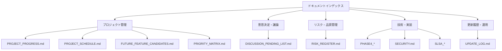

# STARLIST ドキュメントインデックス

## 背景

STARLISTプロジェクトのドキュメントを体系的に整理し、関係者が必要な情報を効率的に探せるようにするための公式インデックスです。本インデックスはドキュメントの全体像を把握し、ナレッジ共有を促進することを目的としています。

## 要件

### 機能要件
- [x] 全ドキュメントの一元的管理
- [x] カテゴリ別・用途別の分類
- [x] 更新頻度と重要度の明示
- [x] 相互参照と関連ドキュメントのリンク

### 非機能要件
- [x] 自動生成による正確性の確保
- [x] リアルタイムでの更新反映
- [x] 全文検索の容易さ

## ドキュメントカテゴリ

### 📊 プロジェクト管理 (Project Management)

#### 進捗・スケジュール関連
- [**PROJECT_PROGRESS.md**](PROJECT_PROGRESS.md) - プロジェクト全体の進捗状況
  - 更新頻度: 日次
  - 対象読者: 全チームメンバー
  - 重要度: 高

- [**PROJECT_SCHEDULE.md**](PROJECT_SCHEDULE.md) - 詳細スケジュールとマイルストーン
  - 更新頻度: 週次
  - 対象読者: PM、チームリーダー
  - 重要度: 高

#### 戦略・計画関連
- [**FUTURE_FEATURE_CANDIDATES.md**](FUTURE_FEATURE_CANDIDATES.md) - 将来機能候補の評価
  - 更新頻度: 月次
  - 対象読者: Product Team、Engineering
  - 重要度: 中

- [**PRIORITY_MATRIX.md**](PRIORITY_MATRIX.md) - タスク優先順位マトリックス
  - 更新頻度: 月次
  - 対象読者: 全チームメンバー
  - 重要度: 高

### 💬 意思決定・議論関連 (Decision Making)

#### 議論管理
- [**DISCUSSION_PENDING_LIST.md**](DISCUSSION_PENDING_LIST.md) - 未解決の技術的議論事項
  - 更新頻度: 週次
  - 対象読者: Architecture Team、Tech Lead
  - 重要度: 高

### ⚠️ リスク・品質管理 (Risk & Quality)

#### リスク管理
- [**RISK_REGISTER.md**](RISK_REGISTER.md) - プロジェクトリスクの一元管理
  - 更新頻度: 週次
  - 対象読者: 全チームメンバー
  - 重要度: 高

### 📚 技術・実装関連 (Technical Documentation)

#### Phase 4: SLSA Provenance
- [**PHASE4_IMPLEMENTATION_SUMMARY.md**](../PHASE4_IMPLEMENTATION_SUMMARY.md) - Phase4実装概要
- [**PHASE4_KPI_README.md**](../PHASE4_KPI_README.md) - KPI機能仕様
- [**PHASE4_AUTO_AUDIT_SELF_HEALING_DESIGN.md**](../PHASE4_AUTO_AUDIT_SELF_HEALING_DESIGN.md) - 自動監査設計
- [**PHASE4_MICROTASKS.md**](../PHASE4_MICROTASKS.md) - 詳細タスク一覧
- [**PHASE4_WS06_WS10_IMPLEMENTATION_PLAN.md**](../PHASE4_WS06_WS10_IMPLEMENTATION_PLAN.md) - WS06-10実装計画

#### セキュリティ・運用
- [**SECURITY.md**](../../../SECURITY.md) - セキュリティポリシー
- [**SLSA_PROVENANCE_20X_IMPLEMENTATION_PLAN.md**](../SLSA_PROVENANCE_20X_IMPLEMENTATION_PLAN.md) - SLSA拡張計画

### 🔄 更新履歴・運用 (Updates & Operations)

#### 更新管理
- [**UPDATE_LOG.md**](UPDATE_LOG.md) - ドキュメント更新履歴
  - 更新頻度: 随時
  - 対象読者: 全チームメンバー
  - 重要度: 中

## ドキュメントマップ

## 更新頻度別分類

### 日次更新
- PROJECT_PROGRESS.md - プロジェクト進捗のリアルタイム追跡

### 週次更新
- PROJECT_SCHEDULE.md - スケジュール調整
- DISCUSSION_PENDING_LIST.md - 議論事項の進捗管理
- RISK_REGISTER.md - リスク評価の更新

### 月次更新
- FUTURE_FEATURE_CANDIDATES.md - 将来機能の再評価
- PRIORITY_MATRIX.md - 優先順位の見直し

### 四半期更新
- 戦略ドキュメント全体の見直し

## 重要度別分類

### 高重要度 (必須参照)
- PROJECT_PROGRESS.md
- PROJECT_SCHEDULE.md
- PRIORITY_MATRIX.md
- DISCUSSION_PENDING_LIST.md
- RISK_REGISTER.md

### 中重要度 (必要時参照)
- FUTURE_FEATURE_CANDIDATES.md
- UPDATE_LOG.md
- 技術仕様ドキュメント

### 低重要度 (参考情報)
- 過去の履歴ドキュメント
- アーカイブ済み資料

## 相互参照マップ

### 主要ドキュメント間の関連性

| ドキュメント | 関連する主なドキュメント |
|-------------|-------------------------|
| PROJECT_PROGRESS.md | PROJECT_SCHEDULE.md, PRIORITY_MATRIX.md |
| PROJECT_SCHEDULE.md | RISK_REGISTER.md, DISCUSSION_PENDING_LIST.md |
| FUTURE_FEATURE_CANDIDATES.md | PRIORITY_MATRIX.md, DISCUSSION_PENDING_LIST.md |
| PRIORITY_MATRIX.md | PROJECT_SCHEDULE.md, RISK_REGISTER.md |
| DISCUSSION_PENDING_LIST.md | RISK_REGISTER.md, PROJECT_SCHEDULE.md |
| RISK_REGISTER.md | PROJECT_PROGRESS.md, PROJECT_SCHEDULE.md |

## ドキュメント品質基準

### 必須要素
- [x] Front-matter（source_of_truth, version, updated_date, owner）
- [x] 背景説明と目的記述
- [x] 要件定義（機能・非機能）
- [x] DoD（完了条件）
- [x] Runbook（運用手順）
- [x] リスク評価
- [x] 連絡先情報

### 品質チェック項目
- [x] 日本語での記述（敬意あるトーン）
- [x] Markdown形式の正確性
- [x] リンクの有効性
- [x] 情報の最新性
- [x] 読みやすさ・検索性

## ドキュメント管理プロセス

### 作成プロセス
1. **要件定義**: 作成目的と対象読者の明確化
2. **テンプレート適用**: STARLIST標準テンプレートの使用
3. **内容作成**: 必要な情報の網羅的記載
4. **レビュー**: 関係者による正確性確認
5. **公開**: 本インデックスへの登録

### 更新プロセス
1. **更新トリガー**: 内容変更の必要性発生
2. **変更実施**: 内容の更新とversion/date修正
3. **影響評価**: 関連ドキュメントへの影響確認
4. **通知**: 関係者への更新通知

### アーカイブプロセス
1. **廃止判断**: ドキュメントの有効性評価
2. **アーカイブ化**: 履歴保存のための別領域移動
3. **インデックス更新**: 本インデックスの更新
4. **参照修正**: 関連ドキュメントのリンク修正

## DoD (Definition of Done)

### ドキュメントインデックス完了の条件
- [x] 全ドキュメントの網羅的登録
- [x] カテゴリ別の適切な分類
- [x] 更新頻度・重要度の明示
- [x] 相互参照の正確性確保
- [x] 品質基準の充足確認
- [x] 定期更新プロセスの確立

## Runbook

### 新規ドキュメント追加手順
1. **ドキュメント作成**: 標準テンプレートを使用
2. **インデックス登録**: 本ファイルへの追加
3. **カテゴリ分類**: 適切なカテゴリへの配置
4. **相互参照設定**: 関連ドキュメントとのリンク
5. **品質チェック**: 基準充足の確認

### インデックス保守手順
1. **定期確認**: 月次でのドキュメント状態確認
2. **更新反映**: 新規・変更・削除の反映
3. **品質維持**: リンク切れ・内容陳腐化のチェック
4. **改善実施**: 利用性向上のための改善

## リスク

### ドキュメント管理のリスク
- **情報陳腐化**: 更新が追いつかないことによる誤情報
  - **対策**: 自動更新メカニズムの導入と定期レビュー

### 利用性のリスク
- **探しにくさ**: インデックスが複雑で必要な情報が見つからない
  - **対策**: シンプルな構造維持と検索機能の強化

## 連絡先

- **ドキュメント管理責任者**: STARLIST Documentation Team
- **技術ライター**: Tech Writing Team
- **最終更新**: 2025-11-15

---

*本インデックスはSTARLISTドキュメント体系の信頼できるナビゲーターです。*
