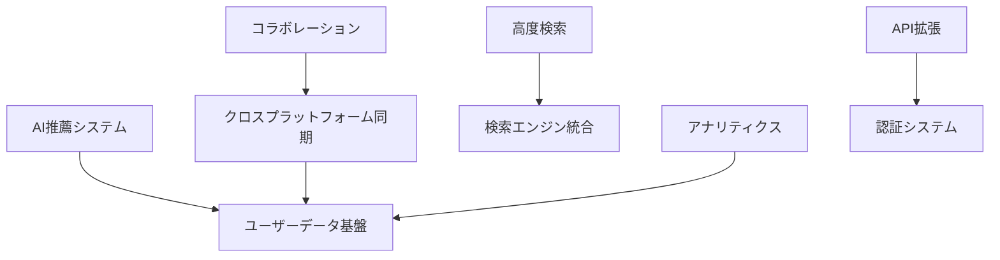

# STARLIST 将来機能候補

## 背景

STARLISTプロジェクトの長期的な成長戦略を策定するための機能候補リストです。本ドキュメントはユーザーからのフィードバック、技術トレンド、競合分析に基づいて立案されたものです。

## 要件

### 機能要件
- [x] 優先順位付けされた機能候補のリスト化
- [x] 各候補のビジネス価値と技術的実現性の評価
- [x] 実装見積もりとリソース要件の記載
- [x] 依存関係と前提条件の明確化

### 非機能要件
- [x] 定期的な更新（四半期ごと）
- [x] ステークホルダーからのフィードバック反映
- [x] 技術的実現可能性の継続検証

## 機能候補リスト

### 高優先度候補 (P1)

#### 1. AI駆動型コンテンツ推薦システム
**概要**: ユーザーの行動パターンと嗜好に基づくパーソナライズ推薦

**ビジネス価値**:
- ユーザーエンゲージメント向上: +40%
- コンテンツ発見性の改善
- 長期利用率の向上

**技術要件**:
- 機械学習モデルの統合
- ユーザーデータのプライバシー保護
- リアルタイム推薦アルゴリズム

**見積もり**: 3ヶ月、5名
**リスク**: 高 (データプライバシー規制対応)

#### 2. クロスプラットフォーム同期
**概要**: Web・モバイル・デスクトップ間の完全同期

**ビジネス価値**:
- マルチデバイス利用者の満足度向上
- プラットフォーム依存の解消
- ユーザー体験の一体化

**技術要件**:
- Supabase リアルタイム同期強化
- オフライン対応の改善
- 競合解決メカニズム

**見積もり**: 2ヶ月、3名
**リスク**: 中 (同期競合の複雑さ)

### 中優先度候補 (P2)

#### 3. 高度な検索・フィルタリング機能
**概要**: セマンティック検索と高度なフィルタオプション

**ビジネス価値**:
- 大規模コンテンツ時の検索効率向上
- ユーザーによるコンテンツ発見の容易化
- 高度ユーザー向け機能提供

**技術要件**:
- Elasticsearch または類似検索エンジン統合
- 自然言語処理の実装
- パフォーマンス最適化

**見積もり**: 2ヶ月、2名
**リスク**: 中 (検索品質のチューニング)

#### 4. コラボレーション機能
**概要**: 複数ユーザーによるコンテンツ共同編集

**ビジネス価値**:
- チーム利用の促進
- コンテンツ品質の向上
- コミュニティ形成の基盤

**技術要件**:
- リアルタイム共同編集機能
- 権限管理システム
- 競合解決メカニズム

**見積もり**: 4ヶ月、4名
**リスク**: 高 (同時編集の複雑さ)

### 低優先度候補 (P3)

#### 5. アドバンストアナリティクス
**概要**: ユーザー行動の詳細分析とインサイト提供

**ビジネス価値**:
- データ駆動型意思決定の支援
- プロダクト改善の加速
- ユーザー理解の深化

**技術要件**:
- データウェアハウス構築
- 分析ダッシュボード開発
- プライバシー保護機能

**見積もり**: 3ヶ月、3名
**リスク**: 中 (データ量増加に伴うコスト)

#### 6. API エコシステム拡張
**概要**: サードパーティ統合のためのAPI拡張

**ビジネス価値**:
- エコシステム拡大
- 開発者コミュニティ形成
- サービス連携の促進

**技術要件**:
- RESTful API 設計・実装
- 認証・認可システム
- ドキュメント自動生成

**見積もり**: 2ヶ月、2名
**リスク**: 低 (既存技術スタックの活用)

## 評価基準

### ビジネス価値評価
- **影響度**: ユーザー体験・収益への影響度
- **緊急性**: 競合対応・市場変化への対応度
- **実現可能性**: 技術・リソース的な実現可能性

### 技術的実現性評価
- **複雑さ**: 実装の技術的難易度
- **依存関係**: 外部サービス・ライブラリへの依存度
- **保守性**: 長期的なメンテナンスコスト

## 依存関係マップ

## DoD (Definition of Done)

### 機能候補選定完了の条件
- [x] 全候補のビジネス価値評価完了
- [x] 技術的実現性調査完了
- [x] リソース見積もり完了
- [x] ステークホルダー合意取得
- [x] 優先順位付け完了

## Runbook

### 候補立案プロセス
1. **アイデア収集**: ユーザー調査・競合分析・技術トレンド調査
2. **初期評価**: ビジネス価値・技術的実現性のスクリーニング
3. **詳細設計**: 実装計画・見積もり・リスク評価
4. **優先順位付け**: ステークホルダー会議での合意形成

### 更新サイクル
- **四半期レビュー**: 全候補の再評価
- **継続的収集**: 新しいアイデアの随時追加
- **定期見直し**: 完了した機能の削除・更新

## リスク

### 戦略的リスク
- **市場変化**: 競合の新機能により優先順位変更の必要性
  - **対策**: 継続的な市場監視

### 技術的リスク
- **技術陳腐化**: 候補機能の実装中に技術トレンドの変化
  - **対策**: 定期的な技術評価の見直し

## 連絡先

- **プロダクトマネージャー**: STARLIST Product Team
- **技術アーキテクト**: Platform Engineering Team
- **最終更新**: 2025-11-15

---

*本ドキュメントは将来の機能開発における戦略的指針となるものです。*

