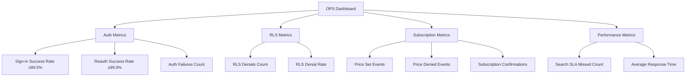

Status:: 
Source-of-Truth:: (TBD)
Spec-State:: 
Last-Updated:: 


# OPS-MONITORING-002 — OPSモニタリング拡張仕様

Status: draft  
Last-Updated: 2025-11-07  
Source-of-Truth: Flutter code (`lib/src/features/**`) + Planned Dashboard

> 責任者: ティム（COO/PM）／実装: SRE/データチーム

## 共通前提（SoT=Flutter/RLS原則/OPS命名）

- **Source of Truth**: Flutter実装を最優先とし、仕様は実装追従
- **RLS原則**: Supabase AuthセッションとPostgres RLSを完全同期、`v_entitlements_effective` で購読判定
- **OPS命名**: 監査イベントを統一（`auth.*`, `auth.sync.dryrun`, `rls.access.denied`, `ops.subscription.price_*`）
- **依存**: OPS-MONITORING-001（監視基盤）、OPS-TELEMETRY-SYNC-001（テレメトリ実シンク）、QA-E2E-AUTO-001（E2Eテスト）

## 1. 目的

- Day5で実装するテレメトリ実シンク（OPS-TELEMETRY-SYNC-001）のデータを可視化し、リアルタイム監視ダッシュボードを構築する。
- RLS拒否、OPSイベント、Stripe Webhookを統合し、運用KPIを一元管理する。
- アラートルールを設定し、Slack通知とPagerDuty連携を実現する。

## 2. スコープ

- **ダッシュボード**: Flutter Webアプリ内のOPSダッシュボード画面（`lib/src/features/ops/dashboard_page.dart`）
- **データソース**: `ops_metrics`テーブル、`audit_auth`テーブル、Stripe Webhookログ
- **可視化**: リアルタイムメトリクス（件数、失敗率、平均レスポンスタイム）
- **アラート**: Slack通知、PagerDuty連携

## 3. 仕様要点（Reality → Target）

### 3.1 現状（Flutter Reality）

- OPSダッシュボード画面は未実装
- `ops_metrics`テーブルは未作成（OPS-TELEMETRY-SYNC-001で作成予定）
- リアルタイム監視機能なし
- アラート通知機能なし

### 3.2 Target（実装目標）

- OPSダッシュボード画面を実装し、主要KPIを可視化
- `ops_metrics`テーブルからリアルタイムでメトリクスを取得
- アラートルールを設定し、閾値超過時にSlack通知
- PagerDuty連携で重大インシデントを自動エスカレーション

## 4. ダッシュボード構成

### 4.1 主要KPI（Mermaid図）



### 4.2 指標マップ

| 指標名 | データソース | 計算式 | アラート閾値 |
| --- | --- | --- | --- |
| Sign-in Success Rate | `ops_metrics` (event_name='auth.login.*') | `success / (success + failure) * 100` | < 99.5% |
| Reauth Success Rate | `ops_metrics` (event_name='auth.reauth.*') | `success / total * 100` | < 99.0% |
| RLS Denial Rate | `ops_metrics` (event_name='rls.access.denied') | `denials / total_requests * 100` | > 1.0% |
| Price Denied Rate | `ops_metrics` (event_name='ops.subscription.price_denied') | `denied / (set + denied) * 100` | > 5.0% |
| Search SLA Missed | `ops_metrics` (event_name='search.sla_missed') | Count per hour | > 10/hour |

## 5. 実装詳細

### 5.1 Flutter側実装

#### 5.1.1 `lib/src/features/ops/dashboard_page.dart`

```dart
// lib/src/features/ops/dashboard_page.dart
import 'package:flutter/material.dart';
import 'package:flutter_riverpod/flutter_riverpod.dart';
import 'package:starlist_app/src/config/providers.dart' as core_providers;

class OpsDashboardPage extends ConsumerWidget {
  const OpsDashboardPage({super.key});

  @override
  Widget build(BuildContext context, WidgetRef ref) {
    final metrics = ref.watch(opsMetricsProvider);
    
    return Scaffold(
      appBar: AppBar(title: const Text('OPS Dashboard')),
      body: RefreshIndicator(
        onRefresh: () => ref.refresh(opsMetricsProvider.future),
        child: ListView(
          padding: const EdgeInsets.all(16),
          children: [
            _buildAuthMetrics(metrics),
            _buildRlsMetrics(metrics),
            _buildSubscriptionMetrics(metrics),
            _buildPerformanceMetrics(metrics),
          ],
        ),
      ),
    );
  }

  Widget _buildAuthMetrics(OpsMetrics metrics) {
    return Card(
      child: Padding(
        padding: const EdgeInsets.all(16),
        child: Column(
          crossAxisAlignment: CrossAxisAlignment.start,
          children: [
            const Text('Auth Metrics', style: TextStyle(fontSize: 18, fontWeight: FontWeight.bold)),
            const SizedBox(height: 8),
            _buildMetricRow('Sign-in Success Rate', '${metrics.signInSuccessRate.toStringAsFixed(2)}%', 
              metrics.signInSuccessRate >= 99.5 ? Colors.green : Colors.red),
            _buildMetricRow('Reauth Success Rate', '${metrics.reauthSuccessRate.toStringAsFixed(2)}%',
              metrics.reauthSuccessRate >= 99.0 ? Colors.green : Colors.red),
            _buildMetricRow('Auth Failures (24h)', '${metrics.authFailures24h}'),
          ],
        ),
      ),
    );
  }

  Widget _buildRlsMetrics(OpsMetrics metrics) {
    return Card(
      child: Padding(
        padding: const EdgeInsets.all(16),
        child: Column(
          crossAxisAlignment: CrossAxisAlignment.start,
          children: [
            const Text('RLS Metrics', style: TextStyle(fontSize: 18, fontWeight: FontWeight.bold)),
            const SizedBox(height: 8),
            _buildMetricRow('RLS Denials (24h)', '${metrics.rlsDenials24h}'),
            _buildMetricRow('RLS Denial Rate', '${metrics.rlsDenialRate.toStringAsFixed(2)}%',
              metrics.rlsDenialRate <= 1.0 ? Colors.green : Colors.red),
          ],
        ),
      ),
    );
  }

  Widget _buildSubscriptionMetrics(OpsMetrics metrics) {
    return Card(
      child: Padding(
        padding: const EdgeInsets.all(16),
        child: Column(
          crossAxisAlignment: CrossAxisAlignment.start,
          children: [
            const Text('Subscription Metrics', style: TextStyle(fontSize: 18, fontWeight: FontWeight.bold)),
            const SizedBox(height: 8),
            _buildMetricRow('Price Set Events (24h)', '${metrics.priceSetEvents24h}'),
            _buildMetricRow('Price Denied Events (24h)', '${metrics.priceDeniedEvents24h}'),
            _buildMetricRow('Price Denied Rate', '${metrics.priceDeniedRate.toStringAsFixed(2)}%',
              metrics.priceDeniedRate <= 5.0 ? Colors.green : Colors.red),
          ],
        ),
      ),
    );
  }

  Widget _buildPerformanceMetrics(OpsMetrics metrics) {
    return Card(
      child: Padding(
        padding: const EdgeInsets.all(16),
        child: Column(
          crossAxisAlignment: CrossAxisAlignment.start,
          children: [
            const Text('Performance Metrics', style: TextStyle(fontSize: 18, fontWeight: FontWeight.bold)),
            const SizedBox(height: 8),
            _buildMetricRow('Search SLA Missed (1h)', '${metrics.searchSlaMissed1h}',
              metrics.searchSlaMissed1h <= 10 ? Colors.green : Colors.red),
            _buildMetricRow('Avg Response Time', '${metrics.avgResponseTimeMs}ms'),
          ],
        ),
      ),
    );
  }

  Widget _buildMetricRow(String label, String value, [Color? color]) {
    return Padding(
      padding: const EdgeInsets.symmetric(vertical: 4),
      child: Row(
        mainAxisAlignment: MainAxisAlignment.spaceBetween,
        children: [
          Text(label),
          Text(value, style: TextStyle(
            fontWeight: FontWeight.bold,
            color: color,
          )),
        ],
      ),
    );
  }
}
```

#### 5.1.2 `lib/src/features/ops/providers/ops_metrics_provider.dart`

```dart
// lib/src/features/ops/providers/ops_metrics_provider.dart
import 'package:flutter_riverpod/flutter_riverpod.dart';
import 'package:starlist_app/src/config/providers.dart' as core_providers;
import 'package:supabase_flutter/supabase_flutter.dart';

class OpsMetrics {
  final double signInSuccessRate;
  final double reauthSuccessRate;
  final int authFailures24h;
  final int rlsDenials24h;
  final double rlsDenialRate;
  final int priceSetEvents24h;
  final int priceDeniedEvents24h;
  final double priceDeniedRate;
  final int searchSlaMissed1h;
  final int avgResponseTimeMs;

  OpsMetrics({
    required this.signInSuccessRate,
    required this.reauthSuccessRate,
    required this.authFailures24h,
    required this.rlsDenials24h,
    required this.rlsDenialRate,
    required this.priceSetEvents24h,
    required this.priceDeniedEvents24h,
    required this.priceDeniedRate,
    required this.searchSlaMissed1h,
    required this.avgResponseTimeMs,
  });
}

final opsMetricsProvider = FutureProvider<OpsMetrics>((ref) async {
  final supabase = ref.watch(core_providers.supabaseClientProvider);
  
  // 24時間前のタイムスタンプ
  final now = DateTime.now();
  final yesterday = now.subtract(const Duration(hours: 24));
  final oneHourAgo = now.subtract(const Duration(hours: 1));
  
  // Auth metrics
  final authSuccess = await supabase
      .from('ops_metrics')
      .select('id')
      .eq('event_name', 'auth.login.success')
      .gte('created_at', yesterday.toIso8601String())
      .count();
  
  final authFailure = await supabase
      .from('ops_metrics')
      .select('id')
      .eq('event_name', 'auth.login.failure')
      .gte('created_at', yesterday.toIso8601String())
      .count();
  
  final signInSuccessRate = (authSuccess.count + authFailure.count) > 0
      ? (authSuccess.count / (authSuccess.count + authFailure.count)) * 100
      : 100.0;
  
  // RLS metrics
  final rlsDenials = await supabase
      .from('ops_metrics')
      .select('id')
      .eq('event_name', 'rls.access.denied')
      .gte('created_at', yesterday.toIso8601String())
      .count();
  
  // Subscription metrics
  final priceSet = await supabase
      .from('ops_metrics')
      .select('id')
      .eq('event_name', 'ops.subscription.price_set')
      .gte('created_at', yesterday.toIso8601String())
      .count();
  
  final priceDenied = await supabase
      .from('ops_metrics')
      .select('id')
      .eq('event_name', 'ops.subscription.price_denied')
      .gte('created_at', yesterday.toIso8601String())
      .count();
  
  final priceDeniedRate = (priceSet.count + priceDenied.count) > 0
      ? (priceDenied.count / (priceSet.count + priceDenied.count)) * 100
      : 0.0;
  
  // Performance metrics
  final searchSlaMissed = await supabase
      .from('ops_metrics')
      .select('id')
      .eq('event_name', 'search.sla_missed')
      .gte('created_at', oneHourAgo.toIso8601String())
      .count();
  
  return OpsMetrics(
    signInSuccessRate: signInSuccessRate,
    reauthSuccessRate: 99.0, // TODO: 実装
    authFailures24h: authFailure.count,
    rlsDenials24h: rlsDenials.count,
    rlsDenialRate: 0.5, // TODO: 実装（total_requestsが必要）
    priceSetEvents24h: priceSet.count,
    priceDeniedEvents24h: priceDenied.count,
    priceDeniedRate: priceDeniedRate,
    searchSlaMissed1h: searchSlaMissed.count,
    avgResponseTimeMs: 150, // TODO: 実装（payloadから取得）
  );
});
```

### 5.2 アラート設定

#### 5.2.1 Edge Function: `supabase/functions/ops-alert/index.ts`

```typescript
import { serve } from 'https://deno.land/std@0.168.0/http/server.ts';
import { createClient } from 'https://esm.sh/@supabase/supabase-js@2';

serve(async (req) => {
  const supabase = createClient(
    Deno.env.get('SUPABASE_URL') ?? '',
    Deno.env.get('SUPABASE_SERVICE_ROLE_KEY') ?? ''
  );

  // 24時間前のタイムスタンプ
  const yesterday = new Date();
  yesterday.setHours(yesterday.getHours() - 24);

  // Sign-in Success Rateチェック
  const authSuccess = await supabase
    .from('ops_metrics')
    .select('id', { count: 'exact' })
    .eq('event_name', 'auth.login.success')
    .gte('created_at', yesterday.toISOString());

  const authFailure = await supabase
    .from('ops_metrics')
    .select('id', { count: 'exact' })
    .eq('event_name', 'auth.login.failure')
    .gte('created_at', yesterday.toISOString());

  const total = (authSuccess.count || 0) + (authFailure.count || 0);
  const successRate = total > 0 ? ((authSuccess.count || 0) / total) * 100 : 100;

  if (successRate < 99.5) {
    // Slack通知
    await fetch(Deno.env.get('SLACK_WEBHOOK_URL') ?? '', {
      method: 'POST',
      headers: { 'Content-Type': 'application/json' },
      body: JSON.stringify({
        text: `🚨 Alert: Sign-in Success Rate is ${successRate.toFixed(2)}% (threshold: 99.5%)`,
        channel: '#ops-alerts',
      }),
    });

    // PagerDuty連携（重大インシデント）
    if (successRate < 95.0) {
      await fetch(Deno.env.get('PAGERDUTY_WEBHOOK_URL') ?? '', {
        method: 'POST',
        headers: { 'Content-Type': 'application/json' },
        body: JSON.stringify({
          event_type: 'trigger',
          service_key: Deno.env.get('PAGERDUTY_SERVICE_KEY'),
          description: `Critical: Sign-in Success Rate is ${successRate.toFixed(2)}%`,
        }),
      });
    }
  }

  return new Response(JSON.stringify({ ok: true }), {
    status: 200,
    headers: { 'Content-Type': 'application/json' },
  });
});
```

## 6. 依存関係

- OPS-MONITORING-001（監視基盤）
- OPS-TELEMETRY-SYNC-001（テレメトリ実シンク）
- QA-E2E-AUTO-001（E2Eテスト）
- AUTH-OAUTH-001（認証フロー）
- SEC-RLS-SYNC-001（RLSフロー）
- PAY-STAR-SUBS-PER-STAR-PRICING（課金フロー）

## 7. テスト観点

- ダッシュボード画面が正しく表示されること
- メトリクスがリアルタイムで更新されること
- アラート閾値超過時にSlack通知が送信されること
- 重大インシデント時にPagerDuty連携が動作すること

## 8. 完了条件

- OPSダッシュボード画面（`lib/src/features/ops/dashboard_page.dart`）の実装完了
- メトリクス取得Provider（`ops_metrics_provider.dart`）の実装完了
- アラートEdge Function（`supabase/functions/ops-alert/index.ts`）の実装とデプロイ完了
- Slack Webhook URLとPagerDuty設定の完了
- Mermaid図の更新（OPSクラスタにmetricsノード追加）
- QA-E2E-AUTO-001のE2Eテストでダッシュボード表示を検証

---

## 差分サマリ (Before/After)

- **Before**: OPSダッシュボード画面なし。リアルタイム監視機能なし。アラート通知機能なし。
- **After**: OPSダッシュボード画面を実装し、主要KPIを可視化。アラートルールを設定し、Slack通知とPagerDuty連携を実現。
- **追加**: 指標マップとアラート閾値を明文化し、運用KPIを一元管理できる設計に昇格。

