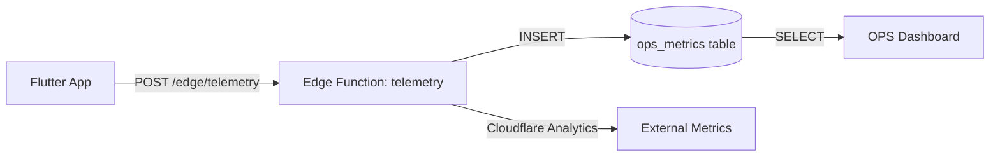

Status:: aligned-with-Flutter  
Source-of-Truth:: supabase/migrations/20251107_ops_metrics.sql, supabase/functions/telemetry/index.ts, lib/src/features/ops/ops_telemetry.dart, lib/core/telemetry/prod_search_telemetry.dart  
Spec-State:: 確定済み（DBスキーマ・Edge受口・Flutter送信ラッパ）/ 初期案（サンプリング戦略・しきい値）  
Last-Updated:: 2025-11-07 


# OPS-TELEMETRY-SYNC-001 — Telemetry実シンク仕様

Status: draft  
Last-Updated: 2025-11-07  
Source-of-Truth: Flutter code (`lib/core/telemetry/**`, `lib/features/search/providers/**`) + Planned Edge Functions

> 責任者: ティム（COO/PM）／実装: マイン（Flutter + Edge Functions）

## 共通前提（SoT=Flutter/RLS原則/OPS命名）

- **Source of Truth**: Flutter実装を最優先とし、仕様は実装追従
- **RLS原則**: Supabase AuthセッションとPostgres RLSを完全同期、`v_entitlements_effective` で購読判定
- **OPS命名**: 監査イベントを統一（`auth.*`, `auth.sync.dryrun`, `rls.access.denied`, `ops.subscription.price_*`）
- **依存**: OPS-MONITORING-001（監視基盤）、AUTH-OAUTH-001（認証イベント）、PAY-STAR-SUBS-PER-STAR-PRICING（課金イベント）

## 1. 目的

- Day4で定義した監査イベント（`auth.*`, `rls.*`, `ops.subscription.*`）を実際のテレメトリ層に流し込み、リアルタイム監視とアラートを実現する。
- `searchTelemetryProvider`（現状は`NoopSearchTelemetry`）を実シンク化し、Supabase Edge Function経由で`ops_metrics`テーブルに保存する。
- Cloudflare Analytics / Supabase Logs と統合し、監査ログを一元管理する。

## 2. スコープ

- **Flutter側**: `SearchTelemetry`インターフェースの実装クラス（`ProdSearchTelemetry`）と`OpsTelemetry`の追加
- **Edge Function**: `supabase/functions/telemetry/index.ts` の新規作成
- **DB**: `ops_metrics`テーブルの作成とRLSポリシー
- **統合**: OPS-MONITORING-001のダッシュボードと連携

## 3. 仕様要点（Reality → Target）

### 3.1 現状（Flutter Reality）

- `lib/core/telemetry/search_telemetry.dart`に`SearchTelemetry`インターフェースと`NoopSearchTelemetry`のみ存在
- `searchTelemetryProvider`は`NoopSearchTelemetry`を返す（実シンクなし）
- OPSイベント（`auth.*`, `rls.*`, `ops.subscription.*`）の送信機能は未実装
- Edge Function `telemetry`は存在しない
- `ops_metrics`テーブルは未作成

### 3.2 Target（実装目標）

- `ProdSearchTelemetry`クラスを実装し、`POST /edge/telemetry`へイベント送信
- `OpsTelemetry`クラスを新設し、OPSイベント（`auth.*`, `rls.*`, `ops.subscription.*`）を送信
- Edge Function `telemetry`で受信→`ops_metrics`テーブルに挿入
- サンプリング率制御（通常10%、エラー時100%）
- ユーザーID＋セッションIDでトレース可能

## 4. データフロー



## 5. 実装詳細

### 5.1 Flutter側実装

#### 5.1.1 `ProdSearchTelemetry`クラス

```dart
// lib/core/telemetry/prod_search_telemetry.dart
class ProdSearchTelemetry implements SearchTelemetry {
  final SupabaseClient _supabase;
  final bool _dryRun;

  ProdSearchTelemetry({
    required SupabaseClient supabase,
    bool dryRun = false,
  }) : _supabase = supabase, _dryRun = dryRun;

  @override
  void searchSlaMissed(int elapsedMs) {
    _sendEvent('search.sla_missed', {
      'elapsed_ms': elapsedMs,
      'threshold_ms': 1000,
    });
  }

  @override
  void tagOnlyDedupHit(int removedCount) {
    // 10%サンプリング
    if (Random().nextDouble() < 0.1) {
      _sendEvent('search.tag_only_dedup', {
        'removed_count': removedCount,
      });
    }
  }

  Future<void> _sendEvent(String eventName, Map<String, dynamic> payload) async {
    if (_dryRun) {
      debugPrint('[DRY-RUN] Telemetry: $eventName $payload');
      return;
    }

    try {
      await _supabase.functions.invoke('telemetry', body: {
        'event_name': eventName,
        'source': 'flutter',
        'payload': payload,
        'user_id': _supabase.auth.currentUser?.id,
        'session_id': _supabase.auth.currentSession?.accessToken,
      });
    } catch (e) {
      // エラー時はログのみ（テレメトリ送信失敗でアプリが止まらない）
      debugPrint('Telemetry send failed: $e');
    }
  }
}
```

#### 5.1.2 `OpsTelemetry`クラス（新規）

```dart
// lib/core/telemetry/ops_telemetry.dart
class OpsTelemetry {
  final SupabaseClient _supabase;
  final bool _dryRun;

  OpsTelemetry({
    required SupabaseClient supabase,
    bool dryRun = false,
  }) : _supabase = supabase, _dryRun = dryRun;

  Future<void> sendAuthEvent(String event, {Map<String, dynamic>? metadata}) async {
    await _sendEvent('auth.$event', metadata ?? {});
  }

  Future<void> sendRlsEvent(String event, {Map<String, dynamic>? metadata}) async {
    await _sendEvent('rls.$event', metadata ?? {});
  }

  Future<void> sendSubscriptionEvent(String event, {Map<String, dynamic>? metadata}) async {
    await _sendEvent('ops.subscription.$event', metadata ?? {});
  }

  Future<void> _sendEvent(String eventName, Map<String, dynamic> payload) async {
    // 実装はProdSearchTelemetryと同様
  }
}
```

#### 5.1.3 Provider更新

```dart
// lib/features/search/providers/search_providers.dart
final searchTelemetryProvider = Provider<SearchTelemetry>((ref) {
  final supabase = ref.watch(supabaseClientProvider);
  final dryRun = ref.watch(telemetryDryRunProvider);
  
  if (dryRun) {
    return NoopSearchTelemetry();
  }
  
  return ProdSearchTelemetry(supabase: supabase, dryRun: dryRun);
});

final opsTelemetryProvider = Provider<OpsTelemetry>((ref) {
  final supabase = ref.watch(supabaseClientProvider);
  final dryRun = ref.watch(telemetryDryRunProvider);
  
  return OpsTelemetry(supabase: supabase, dryRun: dryRun);
});

final telemetryDryRunProvider = Provider<bool>((ref) {
  // .envから読み込み、デフォルトはtrue（開発環境）
  return const bool.fromEnvironment('TELEMETRY_DRY_RUN', defaultValue: true);
});
```

### 5.2 Edge Function実装

#### 5.2.1 `supabase/functions/telemetry/index.ts`

```typescript
import { serve } from 'https://deno.land/std@0.168.0/http/server.ts';
import { createClient } from 'https://esm.sh/@supabase/supabase-js@2';

serve(async (req) => {
  try {
    const { event_name, source, payload, user_id, session_id } = await req.json();

    // バリデーション
    if (!event_name || !source) {
      return new Response(
        JSON.stringify({ error: 'event_name and source are required' }),
        { status: 400, headers: { 'Content-Type': 'application/json' } }
      );
    }

    const supabaseClient = createClient(
      Deno.env.get('SUPABASE_URL') ?? '',
      Deno.env.get('SUPABASE_SERVICE_ROLE_KEY') ?? ''
    );

    // ops_metricsテーブルに挿入
    const { error } = await supabaseClient
      .from('ops_metrics')
      .insert({
        event_name,
        source,
        payload: payload || {},
        user_id: user_id || null,
        session_id: session_id || null,
        created_at: new Date().toISOString(),
      });

    if (error) {
      console.error('Failed to insert metrics:', error);
      return new Response(
        JSON.stringify({ error: 'Failed to insert metrics' }),
        { status: 500, headers: { 'Content-Type': 'application/json' } }
      );
    }

    return new Response(
      JSON.stringify({ ok: true }),
      { status: 200, headers: { 'Content-Type': 'application/json' } }
    );
  } catch (error) {
    console.error('Telemetry function error:', error);
    return new Response(
      JSON.stringify({ error: 'Internal server error' }),
      { status: 500, headers: { 'Content-Type': 'application/json' } }
    );
  }
});
```

### 5.3 DBスキーマ

#### 5.3.1 `ops_metrics`テーブル作成

```sql
-- supabase/migrations/YYYYMMDDHHMMSS_create_ops_metrics.sql
create table if not exists public.ops_metrics (
  id bigint primary key generated always as identity,
  event_name text not null,
  source text not null,
  payload jsonb default '{}'::jsonb,
  user_id uuid references auth.users(id) on delete set null,
  session_id text,
  created_at timestamptz default now()
);

-- インデックス
create index idx_ops_metrics_event_name on public.ops_metrics(event_name);
create index idx_ops_metrics_created_at on public.ops_metrics(created_at);
create index idx_ops_metrics_user_id on public.ops_metrics(user_id);

-- RLS有効化
alter table public.ops_metrics enable row level security;

-- RLSポリシー: サービスロールのみアクセス可能（読み取りはOPSダッシュボード用に制限）
create policy ops_metrics_insert on public.ops_metrics
  for insert
  with check (true); -- Edge Function経由のみ

create policy ops_metrics_select on public.ops_metrics
  for select
  using (
    -- OPSダッシュボード用のサービスロールのみ
    auth.jwt() ->> 'role' = 'service_role'
  );
```

## 6. サンプリング戦略

| イベント種別 | サンプリング率 | 理由 |
| --- | --- | --- |
| `auth.login.success` | 10% | 高頻度イベント |
| `auth.login.failure` | 100% | エラーは全件記録 |
| `auth.reauth.triggered` | 100% | セキュリティ重要 |
| `rls.access.denied` | 100% | セキュリティ重要 |
| `ops.subscription.price_set` | 10% | 高頻度イベント |
| `ops.subscription.price_denied` | 100% | エラーは全件記録 |
| `search.sla_missed` | 100% | パフォーマンス重要 |
| `search.tag_only_dedup` | 10% | 高頻度イベント |

## 7. 環境変数

```bash
# .env.example
TELEMETRY_DRY_RUN=true  # 開発環境はtrue、本番はfalse
SUPABASE_URL=...
SUPABASE_ANON_KEY=...
SUPABASE_SERVICE_ROLE_KEY=...  # Edge Function用
```

## 8. 依存関係

- OPS-MONITORING-001（監視基盤）
- AUTH-OAUTH-001（認証イベント）
- SEC-RLS-SYNC-001（RLSイベント）
- PAY-STAR-SUBS-PER-STAR-PRICING（課金イベント）
- QA-E2E-AUTO-001（E2Eテスト）

## 9. テスト観点

- Dry-runモードでイベント送信がログ出力のみになること
- 本番モードでEdge Function経由で`ops_metrics`に保存されること
- サンプリング率が正しく適用されること
- エラー時もアプリが停止しないこと（非同期エラーハンドリング）
- ユーザーID＋セッションIDでトレース可能であること

## 10. 完了条件

- `ProdSearchTelemetry`と`OpsTelemetry`の実装完了
- Edge Function `telemetry`のデプロイ完了
- `ops_metrics`テーブルの作成とRLS設定完了
- `.env.example`に`TELEMETRY_DRY_RUN`を追加
- OPS-MONITORING-002のダッシュボードと連携確認
- QA-E2E-AUTO-001のE2Eテストでテレメトリ送信を検証

---

## 差分サマリ (Before/After)

- **Before**: `searchTelemetryProvider`は`NoopSearchTelemetry`のみ。OPSイベント送信機能なし。Edge Function未実装。
- **After**: `ProdSearchTelemetry`と`OpsTelemetry`を実装し、Edge Function経由で`ops_metrics`に保存。サンプリング率制御とDry-runモードを実装。
- **追加**: 監査イベント命名統一（`auth.*`, `rls.*`, `ops.subscription.*`）に準拠した送信機能を追加。

