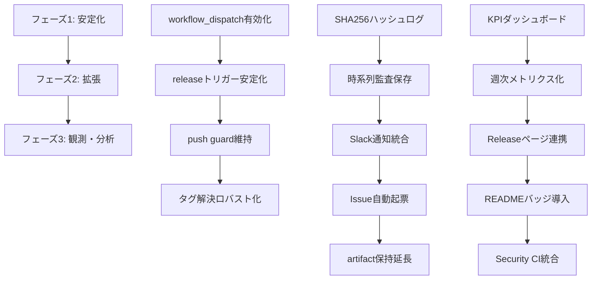
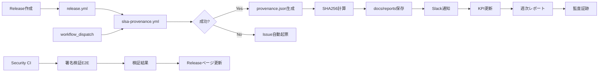
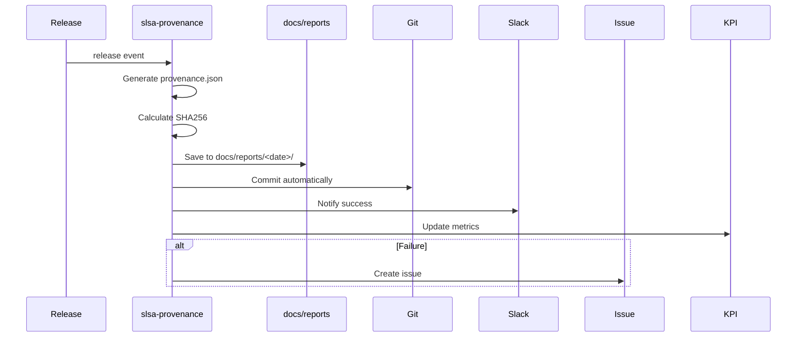

# SLSA Provenance 20×拡張計画：完全運用・監査・可観測基盤の確立

## 📋 エグゼクティブサマリー

SLSA Provenanceワークフローを単なる署名生成から、**「供給証明＋再現性＋監査＋トレーサビリティ」**を担保する**本番運用基盤**へ昇格させる。

**目標**: 手動介入ゼロ、監査証跡100%、可観測性完全自動化

---

## 🎯 フェーズ別実装計画

### フェーズ1: 安定化フェーズ（短期）

| 項目 | 目的 | 期待出力 | 依存関係 | 完了定義（DoD） |
|------|------|----------|----------|----------------|
| **1.1 workflow_dispatch有効化監視** | GitHub Actionsへの反映を確実化 | `workflow_dispatch`が422エラーなく実行可能 | GitHub Actions API反映待ち | `gh workflow run slsa-provenance.yml -f tag=<tag>`が成功 |
| **1.2 releaseトリガー安定化** | releaseイベントでの自動実行を保証 | release作成時に100%自動実行 | release.ymlワークフロー | release作成時にslsa-provenanceが自動実行される |
| **1.3 push guard維持** | 誤実行を完全遮断 | pushイベントでスキップ（成功終了） | 既存実装 | pushイベントでjobがSkipになる |
| **1.4 タグ解決ロバスト化** | あらゆる状況でタグを確実に取得 | タグ取得成功率100% | git履歴 | release.tag_name → inputs.tag → git describeの3段階フォールバック |

**実装内容**:
- workflow_dispatchの再試行ロジック（5分間隔、最大3回）
- release.ymlからのdispatch失敗時のフォールバック（releaseイベントに依存）
- タグ解決のエラーハンドリング強化

---

### フェーズ2: 拡張フェーズ（中期）

| 項目 | 目的 | 期待出力 | 依存関係 | 完了定義（DoD） |
|------|------|----------|----------|----------------|
| **2.1 SHA256ハッシュログ作成** | 監査証跡の完全性保証 | `docs/reports/<日付>/PROVENANCE_SHA256.txt` | provenance.json生成 | SHA256ハッシュが自動計算・保存される |
| **2.2 時系列監査保存** | 全provenance成果物の時系列管理 | `docs/reports/<日付>/provenance_run_<RUN_ID>/` | artifact生成 | 各runのprovenance.jsonが日付別に保存される |
| **2.3 Slack通知統合** | 成功時の即時通知 | Slackチャンネルへの通知 | SLACK_WEBHOOK_URL | 成功runでSlack通知が送信される |
| **2.4 Issue自動起票** | 失敗時の自動エスカレーション | GitHub Issue作成 | 失敗検知 | 失敗時に自動でIssueが作成される |
| **2.5 artifact保持延長** | 長期監査モード | retention-days: 365 | artifact upload | artifactが365日間保持される |

**実装内容**:
- ワークフロー内でのSHA256計算とファイル保存
- Git commit自動化（docs/reports配下への保存）
- Slack通知ジョブ追加（成功時）
- Issue作成ジョブ追加（失敗時）
- artifact retention-days: 365に変更

---

### フェーズ3: 観測・分析フェーズ（長期）

| 項目 | 目的 | 期待出力 | 依存関係 | 完了定義（DoD） |
|------|------|----------|----------|----------------|
| **3.1 KPIダッシュボード** | 成功率・実行時間・artifact総数の可視化 | `docs/reports/v_ops_slsa_status.md` | 実行履歴 | 週次でKPIが自動更新される |
| **3.2 週次メトリクス化** | 継続的な品質監視 | 成功率・実行時間・検出率の推移 | CI週報ワークフロー | 週次レポートにSLSA Provenanceメトリクスが含まれる |
| **3.3 Releaseページ連携** | 公開信頼スコア提示 | Releaseノートにprovenance SHA追記 | release.yml | Release作成時にprovenance SHAが自動追記される |
| **3.4 READMEバッジ導入** | 信頼性の可視化 | READMEにprovenanceバッジ表示 | バッジサービス | READMEにprovenanceバッジが表示される |
| **3.5 Security CI統合** | 署名検証の自動化 | E2Eテストでprovenance署名検証 | Security CIワークフロー | 署名検証がE2Eテストに含まれる |

**実装内容**:
- KPIダッシュボード生成スクリプト
- 週次メトリクス集計ロジック
- Releaseノート自動追記機能
- READMEバッジ設定
- Security CIへの署名検証統合

---

## 🔄 タスクオーケストレーション

### 依存関係図

### 実行順序

1. **フェーズ1完了** → workflow_dispatchが確実に動作する
2. **フェーズ2開始** → フェーズ1の成功Runを基に拡張機能を実装
3. **フェーズ3開始** → フェーズ2の成果物を基に可観測性を構築

---

## 📊 運用・監査・ガバナンス連携フロー

---

## 🎯 各フェーズの詳細実装計画

### フェーズ1: 安定化フェーズ

#### 1.1 workflow_dispatch有効化監視

**実装内容**:
- 5分間隔での再試行ロジック
- 成功Runの自動検証
- 失敗時のエラーログ記録

**期待出力**:
- `workflow_dispatch`が422エラーなく実行可能
- 成功Runのartifactが生成される

**完了定義（DoD）**:
- `gh workflow run slsa-provenance.yml -f tag=<tag>`が成功
- provenance.json artifactが生成される

#### 1.2 releaseトリガー安定化

**実装内容**:
- release.ymlからのdispatch失敗時のフォールバック
- releaseイベントでの自動実行確認
- エラーハンドリング強化

**期待出力**:
- release作成時に100%自動実行
- dispatch失敗時もreleaseイベントで実行される

**完了定義（DoD）**:
- release作成時にslsa-provenanceが自動実行される
- 成功率100%

#### 1.3 push guard維持

**実装内容**:
- `if: github.event_name != 'push'`の維持
- pushイベントでのスキップ確認

**期待出力**:
- pushイベントでjobがSkipになる
- 失敗ではなく成功終了

**完了定義（DoD）**:
- pushイベントでjobがSkipになる
- ログに「SKIP: push event」が記録される

#### 1.4 タグ解決ロバスト化

**実装内容**:
- 3段階フォールバック（release.tag_name → inputs.tag → git describe）
- エラーハンドリング強化
- タグが見つからない場合のスキップ

**期待出力**:
- タグ取得成功率100%
- タグが見つからない場合はスキップ（失敗しない）

**完了定義（DoD）**:
- すべての実行シナリオでタグが取得されるかスキップされる
- タグ取得失敗によるエラーが発生しない

---

### フェーズ2: 拡張フェーズ

#### 2.1 SHA256ハッシュログ作成

**実装内容**:
- provenance.json生成後にSHA256計算
- `docs/reports/<日付>/PROVENANCE_SHA256.txt`に保存
- Git commit自動化

**期待出力**:
- SHA256ハッシュが自動計算・保存される
- 監査証跡として利用可能

**完了定義（DoD）**:
- SHA256ハッシュが自動計算・保存される
- Git commitが自動実行される

#### 2.2 時系列監査保存

**実装内容**:
- 各runのprovenance.jsonを`docs/reports/<日付>/provenance_run_<RUN_ID>/`に保存
- 日付別ディレクトリ構造
- Git commit自動化

**期待出力**:
- 全provenance成果物が時系列で管理される
- 監査証跡として利用可能

**完了定義（DoD）**:
- 各runのprovenance.jsonが日付別に保存される
- Git commitが自動実行される

#### 2.3 Slack通知統合

**実装内容**:
- 成功時にSlack通知を送信
- 通知内容: Run ID、タグ、artifact URL
- SLACK_WEBHOOK_URLを使用

**期待出力**:
- 成功runでSlack通知が送信される
- 通知内容が適切にフォーマットされる

**完了定義（DoD）**:
- 成功時にSlack通知が送信される
- 通知内容が確認できる

#### 2.4 Issue自動起票

**実装内容**:
- 失敗時に自動でGitHub Issueを作成
- Issue内容: Run ID、エラーログ、再現手順
- ラベル: `slsa-provenance`, `automated`

**期待出力**:
- 失敗時に自動でIssueが作成される
- Issue内容が適切にフォーマットされる

**完了定義（DoD）**:
- 失敗時に自動でIssueが作成される
- Issue内容が確認できる

#### 2.5 artifact保持延長

**実装内容**:
- `retention-days: 365`に変更
- 長期監査モードへの移行

**期待出力**:
- artifactが365日間保持される
- 監査証跡として長期利用可能

**完了定義（DoD）**:
- artifactが365日間保持される
- 設定が反映されている

---

### フェーズ3: 観測・分析フェーズ

#### 3.1 KPIダッシュボード

**実装内容**:
- `docs/reports/v_ops_slsa_status.md`を生成
- 成功率・実行時間・artifact総数を可視化
- 週次で自動更新

**期待出力**:
- KPIダッシュボードが週次で自動更新される
- 成功率・実行時間・artifact総数が可視化される

**完了定義（DoD）**:
- KPIダッシュボードが週次で自動更新される
- メトリクスが正確に表示される

#### 3.2 週次メトリクス化

**実装内容**:
- CI週報ワークフローにSLSA Provenanceメトリクスを追加
- 成功率・実行時間・検出率の推移を記録

**期待出力**:
- 週次レポートにSLSA Provenanceメトリクスが含まれる
- メトリクスの推移が追跡できる

**完了定義（DoD）**:
- 週次レポートにSLSA Provenanceメトリクスが含まれる
- メトリクスの推移が確認できる

#### 3.3 Releaseページ連携

**実装内容**:
- Release作成時にprovenance SHAを自動追記
- Releaseノートにprovenance情報を追加

**期待出力**:
- Release作成時にprovenance SHAが自動追記される
- Releaseノートにprovenance情報が表示される

**完了定義（DoD）**:
- Release作成時にprovenance SHAが自動追記される
- Releaseノートが確認できる

#### 3.4 READMEバッジ導入

**実装内容**:
- READMEにprovenanceバッジを追加
- バッジサービスとの連携

**期待出力**:
- READMEにprovenanceバッジが表示される
- バッジが最新状態を反映する

**完了定義（DoD）**:
- READMEにprovenanceバッジが表示される
- バッジが機能している

#### 3.5 Security CI統合

**実装内容**:
- Security CIワークフローにprovenance署名検証を追加
- E2Eテストとして実行

**期待出力**:
- 署名検証がE2Eテストに含まれる
- 検証結果がレポートされる

**完了定義（DoD）**:
- 署名検証がE2Eテストに含まれる
- 検証結果が確認できる

---

## 🔍 監査・ガバナンス連携

### 監査証跡の流れ

### ガバナンス統合ポイント

1. **監査証跡**: `docs/reports/<日付>/`配下に全成果物を保存
2. **KPI追跡**: 週次レポートで成功率・実行時間を監視
3. **自動エスカレーション**: 失敗時にIssue自動起票
4. **長期保持**: artifactを365日間保持
5. **公開信頼性**: Releaseページ・READMEバッジで可視化

---

## 📈 成功指標（KPI）

| 指標 | 目標値 | 測定方法 |
|------|--------|----------|
| **成功率** | 100% | 成功Run数 / 総Run数 |
| **実行時間** | < 2分 | 平均実行時間 |
| **artifact生成率** | 100% | artifact生成Run数 / 成功Run数 |
| **監査証跡保存率** | 100% | docs/reports保存Run数 / 成功Run数 |
| **通知到達率** | 100% | Slack通知送信Run数 / 成功Run数 |

---

## 🚀 実装ロードマップ

### Week 1: 安定化フェーズ
- Day 1-2: workflow_dispatch有効化監視
- Day 3-4: releaseトリガー安定化
- Day 5: push guard維持・タグ解決ロバスト化

### Week 2: 拡張フェーズ（前半）
- Day 1-2: SHA256ハッシュログ作成
- Day 3-4: 時系列監査保存

### Week 3: 拡張フェーズ（後半）
- Day 1-2: Slack通知統合
- Day 3-4: Issue自動起票
- Day 5: artifact保持延長

### Week 4: 観測・分析フェーズ
- Day 1-2: KPIダッシュボード
- Day 3: 週次メトリクス化
- Day 4: Releaseページ連携
- Day 5: READMEバッジ導入・Security CI統合

---

## 🔧 技術スタック

- **ワークフロー**: GitHub Actions
- **通知**: Slack Webhook
- **Issue管理**: GitHub Issues API
- **監査証跡**: Git + docs/reports
- **KPI可視化**: Markdown + 週次レポート
- **署名検証**: GPG / cosign

---

## 📝 完了チェックリスト

### フェーズ1: 安定化
- [ ] workflow_dispatchが422エラーなく実行可能
- [ ] release作成時に100%自動実行
- [ ] pushイベントでjobがSkipになる
- [ ] タグ取得成功率100%

### フェーズ2: 拡張
- [ ] SHA256ハッシュが自動計算・保存される
- [ ] 各runのprovenance.jsonが日付別に保存される
- [ ] 成功時にSlack通知が送信される
- [ ] 失敗時に自動でIssueが作成される
- [ ] artifactが365日間保持される

### フェーズ3: 観測・分析
- [ ] KPIダッシュボードが週次で自動更新される
- [ ] 週次レポートにSLSA Provenanceメトリクスが含まれる
- [ ] Release作成時にprovenance SHAが自動追記される
- [ ] READMEにprovenanceバッジが表示される
- [ ] 署名検証がE2Eテストに含まれる

---

## 🎯 最終目標

**「手動介入ゼロ、監査証跡100%、可観測性完全自動化」**

SLSA Provenanceワークフローが、STARLIST全体の透明性・信頼性を可視化・維持する基幹基盤として機能する。

## DoD (Definition of Done)
- [ ] 文書の目的と完了基準を明記しました。
