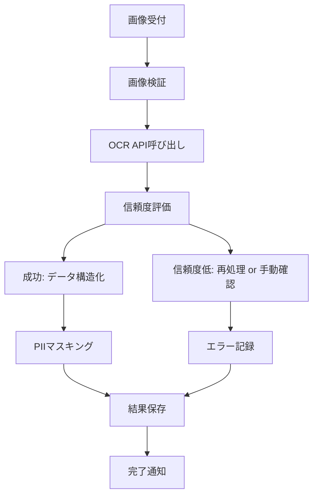

---

spec_id: ING-PIPE-OCR-ONEPAGER

scope: Ingest Pipeline／OCR／スクリーンショット解析

status: draft

source_of_truth: true

last_updated: 2025-11-07 JST

relates:

  - ING-PIPE-CORE-001

  - ING-OCR-IMAGE-002

  - ING-SCREENSHOT-003

  - ING-YT-PIPE-004

owners:

  - pm: Tim

  - impl: Mine

review_flow: AI(ingestプリセット) -> Tim(最終)

---

# 要約（まずここだけ読めばOK）

- **目的：**  

  スターやユーザーがアップした「レシート」「スクショ」「YouTube履歴」を安全・正確に取り込む。  

  同じ画像や個人情報を誤って共有しないよう、全工程を自動チェック。

- **核となる機能：**

  ① 重複防止（checksum／phash）  

  ② PII自動マスキング（個人情報を隠す）  

  ③ OCR解析＋信頼度閾値  

  ④ タイムアウト時のみ再試行  

  ⑤ 全操作を監査ログに残す

---

## パイプライン概要（非エンジニア向け）

1. 画像やスクショをアップすると、まず**重複判定**。  

   → 同じ内容（phash閾値95%以上）は**弾かれる**。

2. 次に**OCR解析**。  

   - 文字抽出後、信頼度が70%未満なら再解析を1回まで。  

   - メール・電話・住所は `<PII:*>` に置換。

3. 解析結果をSupabaseへ保存。  

   - **署名URL（60秒）**で購読者だけが閲覧できる。  

   - 閲覧・再試行・失敗もすべて `audit_ingest` に記録。

`code_refs:` ingest function / OCR worker / phash util : `<TODO>`

---

## 冪等性・再試行ルール

- **冪等性:** 同じファイル名＋サイズ＋hash は1回だけ記録  

- **再試行:** TIMEOUT のみ指数バックオフ（3回上限）  

- **例外:** 認証エラー／APIキー不備は再試行しない

`code_refs:` retry logic / error enum : `<TODO>`

---

## PIIマスキング（対象・除外）

| 種類 | 正規表現例 | 置換後 | 備考 |

|:--|:--|:--|:--|

| メール | `[A-Z0-9._%+-]+@[A-Z0-9.-]+` | `<PII:EMAIL>` | |

| 電話番号 | `0\d{1,4}-\d{1,4}-\d{4}` | `<PII:TEL>` | |

| 住所 | `〒?\d{3}-\d{4}` など | `<PII:ADDR>` | |

| 除外 | SNSハンドル・商品名 | - | 変換しない |

`code_refs:` pii_mask util : `<TODO>`

---

## 監査ログ（audit_ingest）

| 列名 | 型 | 説明 |

|:--|:--|:--|

| id | uuid | 一意ID |

| user_id | uuid | 実行者 |

| source_type | text | receipt / screenshot / youtube |

| result | jsonb | 解析結果 |

| duration_ms | int | 処理時間 |

| retries | int | 再試行回数 |

| error | text | 最終エラー内容 |

| created_at | timestamptz | 記録時刻 |

`code_refs:` audit_ingest schema : `<TODO>`

---

## テレメトリ（可視化）

- 成功率・平均処理時間・再試行率をダッシュボード化  

- Cloudflare Analytics + Supabase Log Export で自動収集  

- 閾値逸脱は Slack 通知

`code_refs:` telemetry config : `<TODO>`

---

## この1ページのゴール

データ取り込みが「**二度と同じ画像を登録しない／個人情報を残さない／障害が追える**」状態に。  

4本の Ingest 仕様を `source_of_truth:true` に昇格し、Day3完了＝仕様20本コンプリートへ。

---

# OCR 画像解析仕様

## 目的 / スコープ

- アップロードされた画像から文字情報を高精度で抽出し、構造化データに変換
- Google Cloud Vision APIを活用したOCR処理と信頼度ベースの品質管理を実装

## 技術仕様

### OCRエンジン選定
- **プライマリ**: Google Cloud Vision API (TEXT_DETECTION)
- **バックアップ**: Tesseract OCR (フォールバック用)
- **言語設定**: ja (日本語優先) + en (英語補助)

### 入力仕様
- **対応フォーマット**: JPEG, PNG, BMP, TIFF, WebP
- **最大サイズ**: 20MB
- **解像度推奨**: 300 DPI以上
- **文字サイズ**: 最小8pt以上推奨

### 出力仕様
- **データ形式**: JSON構造化
- **文字コード**: UTF-8
- **座標情報**: バウンディングボックス含む
- **信頼度スコア**: 0.0-1.0の範囲

## 処理フロー



## 信頼度管理

### 評価基準
- **高信頼度**: 0.9以上 (自動承認)
- **中信頼度**: 0.7-0.9 (再処理検討)
- **低信頼度**: 0.7未満 (手動確認 or 拒否)

### 改善策
- **画像前処理**: コントラスト調整、ノイズ除去、回転補正
- **複数モデル**: TEXT_DETECTION + DOCUMENT_TEXT_DETECTIONの組み合わせ
- **言語ヒント**: 日本語優先で解析

## エラー処理

### 一般エラー
- **INVALID_ARGUMENT**: 画像フォーマットエラー
- **PERMISSION_DENIED**: APIキー無効
- **RESOURCE_EXHAUSTED**: レート制限超過

### 回復戦略
- **再試行**: 一時的なAPI障害の場合
- **フォールバック**: プライマリAPI失敗時にTesseract使用
- **キューイング**: 高負荷時の処理遅延

## PII検出・置換

### 検出パターン
```regex
# メールアドレス
/[A-Z0-9._%+-]+@[A-Z0-9.-]+\.[A-Z]{2,}/i

# 電話番号
/0\d{1,4}-\d{1,4}-\d{4}/

# 郵便番号
/〒?\d{3}-\d{4}/

# 住所（基本パターン）
/[東京都|大阪府|...][^0-9]*/
```

### 置換ルール
- **メール**: `<PII:EMAIL>`
- **電話**: `<PII:TEL>`
- **住所**: `<PII:ADDR>`
- **その他PII**: `<PII:OTHER>`

## パフォーマンス最適化

### キャッシュ戦略
- **結果キャッシュ**: 同一画像の再解析回避
- **中間結果保存**: 処理途中の状態保持
- **CDN活用**: 画像配信の高速化

### 並行処理
- **バッチ処理**: 複数画像の一括処理
- **キュー管理**: 優先度ベースの処理順序
- **リソース制限**: CPU/メモリ使用量の制御

## 品質保証

### テストデータ
- **合成画像**: 様々な文字サイズ・フォント・背景
- **実画像**: 実際のレシート・スクリーンショット
- **異常データ**: ぼやけ・回転・低解像度画像

### 評価指標
- **精度**: 文字認識率85%以上
- **速度**: 平均処理時間3秒以内
- **可用性**: 99.5%以上のAPI可用性

## 監視・運用

### メトリクス
- OCR成功率
- 平均処理時間
- APIコスト
- エラー率（種類別）

### アラート設定
- 精度低下（<80%）
- 処理遅延（>10秒）
- APIエラー増加
- コスト超過

## セキュリティ

### データ保護
- **転送中**: HTTPS/TLS 1.3
- **保存中**: Supabase暗号化
- **アクセス**: RLSによる厳格制御

### APIセキュリティ
- **認証**: GCPサービスアカウント
- **権限**: 最小権限の原則
- **監査**: 全API呼び出しのログ記録
