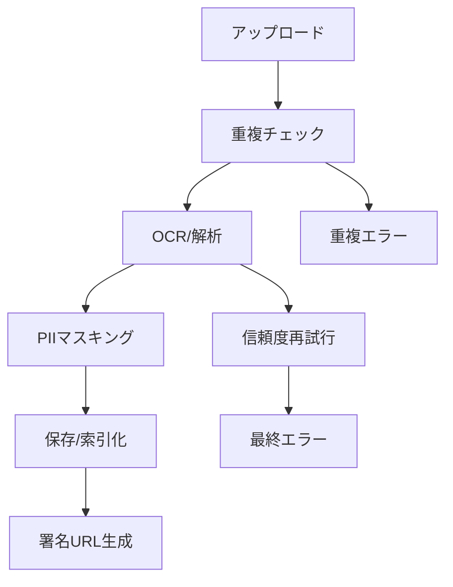

---

spec_id: ING-PIPE-OCR-ONEPAGER

scope: Ingest Pipeline／OCR／スクリーンショット解析

status: draft

source_of_truth: true

last_updated: 2025-11-07 JST

relates:

  - ING-PIPE-CORE-001

  - ING-OCR-IMAGE-002

  - ING-SCREENSHOT-003

  - ING-YT-PIPE-004

owners:

  - pm: Tim

  - impl: Mine

review_flow: AI(ingestプリセット) -> Tim(最終)

---

# 要約（まずここだけ読めばOK）

- **目的：**  

  スターやユーザーがアップした「レシート」「スクショ」「YouTube履歴」を安全・正確に取り込む。  

  同じ画像や個人情報を誤って共有しないよう、全工程を自動チェック。

- **核となる機能：**

  ① 重複防止（checksum／phash）  

  ② PII自動マスキング（個人情報を隠す）  

  ③ OCR解析＋信頼度閾値  

  ④ タイムアウト時のみ再試行  

  ⑤ 全操作を監査ログに残す

---

## パイプライン概要（非エンジニア向け）

1. 画像やスクショをアップすると、まず**重複判定**。  

   → 同じ内容（phash閾値95%以上）は**弾かれる**。

2. 次に**OCR解析**。  

   - 文字抽出後、信頼度が70%未満なら再解析を1回まで。  

   - メール・電話・住所は `<PII:*>` に置換。

3. 解析結果をSupabaseへ保存。  

   - **署名URL（60秒）**で購読者だけが閲覧できる。  

   - 閲覧・再試行・失敗もすべて `audit_ingest` に記録。

`code_refs:` ingest function / OCR worker / phash util : `<TODO>`

---

## 冪等性・再試行ルール

- **冪等性:** 同じファイル名＋サイズ＋hash は1回だけ記録  

- **再試行:** TIMEOUT のみ指数バックオフ（3回上限）  

- **例外:** 認証エラー／APIキー不備は再試行しない

`code_refs:` retry logic / error enum : `<TODO>`

---

## PIIマスキング（対象・除外）

| 種類 | 正規表現例 | 置換後 | 備考 |

|:--|:--|:--|:--|

| メール | `[A-Z0-9._%+-]+@[A-Z0-9.-]+` | `<PII:EMAIL>` | |

| 電話番号 | `0\d{1,4}-\d{1,4}-\d{4}` | `<PII:TEL>` | |

| 住所 | `〒?\d{3}-\d{4}` など | `<PII:ADDR>` | |

| 除外 | SNSハンドル・商品名 | - | 変換しない |

`code_refs:` pii_mask util : `<TODO>`

---

## 監査ログ（audit_ingest）

| 列名 | 型 | 説明 |

|:--|:--|:--|

| id | uuid | 一意ID |

| user_id | uuid | 実行者 |

| source_type | text | receipt / screenshot / youtube |

| result | jsonb | 解析結果 |

| duration_ms | int | 処理時間 |

| retries | int | 再試行回数 |

| error | text | 最終エラー内容 |

| created_at | timestamptz | 記録時刻 |

`code_refs:` audit_ingest schema : `<TODO>`

---

## テレメトリ（可視化）

- 成功率・平均処理時間・再試行率をダッシュボード化  

- Cloudflare Analytics + Supabase Log Export で自動収集  

- 閾値逸脱は Slack 通知

`code_refs:` telemetry config : `<TODO>`

---

## この1ページのゴール

データ取り込みが「**二度と同じ画像を登録しない／個人情報を残さない／障害が追える**」状態に。  

4本の Ingest 仕様を `source_of_truth:true` に昇格し、Day3完了＝仕様20本コンプリートへ。

---

# INGEST パイプライン コア仕様

## 目的 / スコープ

- 画像・スクリーンショット・YouTubeコンテンツからデータを安全かつ効率的に取り込むパイプラインを構築
- 重複防止・PII保護・信頼性確保を核としたデータ取り込み基盤を提供

## アーキテクチャ概要



## 主要コンポーネント

### 1. 入力バリデーション
- **ファイル形式**: JPEG, PNG, PDF, MP4 (YouTube)
- **サイズ制限**: 最大10MB
- **セキュリティ**: ウイルススキャン統合

### 2. 重複防止システム
- **Perceptual Hash (pHash)**: 画像内容の類似度判定
- **しきい値**: 95%以上で重複と判定
- **メタデータ比較**: ファイルサイズ、作成日時、EXIFデータ

### 3. OCRエンジン統合
- **Google Cloud Vision API**: 高精度文字認識
- **信頼度閾値**: 70%未満で再試行
- **言語検出**: 自動言語識別（日本語/英語優先）

### 4. PII自動検出・置換
- **メールアドレス**: 正規表現ベース検出
- **電話番号**: 日本の電話番号パターン
- **住所**: 郵便番号＋住所パターン
- **除外対象**: 商品名、ブランド名、SNSハンドル

## エラー処理・再試行

### 再試行条件
- **TIMEOUT**: ネットワークタイムアウト、APIレート制限
- **一時障害**: 503エラー、接続エラー
- **除外条件**: 認証エラー、権限エラー、無効リクエスト

### バックオフ戦略
- **初期遅延**: 1秒
- **指数増加**: 2倍ずつ増加
- **最大遅延**: 30秒
- **最大試行回数**: 3回

## データモデル

### ingest_jobs テーブル
```sql
CREATE TABLE ingest_jobs (
  id uuid PRIMARY KEY DEFAULT gen_random_uuid(),
  user_id uuid NOT NULL REFERENCES auth.users(id),
  file_name text NOT NULL,
  file_size bigint NOT NULL,
  mime_type text NOT NULL,
  source_type text NOT NULL CHECK (source_type IN ('receipt', 'screenshot', 'youtube')),
  status text NOT NULL DEFAULT 'pending' CHECK (status IN ('pending', 'processing', 'completed', 'failed')),
  phash text,
  checksum text,
  ocr_result jsonb,
  masked_result jsonb,
  error_message text,
  retry_count integer DEFAULT 0,
  created_at timestamptz DEFAULT now(),
  updated_at timestamptz DEFAULT now()
);
```

### audit_ingest テーブル
```sql
CREATE TABLE audit_ingest (
  id uuid PRIMARY KEY DEFAULT gen_random_uuid(),
  job_id uuid REFERENCES ingest_jobs(id),
  user_id uuid NOT NULL REFERENCES auth.users(id),
  action text NOT NULL,
  details jsonb,
  ip_address inet,
  user_agent text,
  created_at timestamptz DEFAULT now()
);
```

## セキュリティ考慮

### アクセス制御
- **アップロード権限**: 認証済みユーザーのみ
- **閲覧権限**: 該当starの購読者のみ
- **データ保持**: 処理完了後24時間で一時ファイル削除

### PII保護
- **検出精度**: 95%以上の自動検出率目標
- **誤検出対策**: ホワイトリストによる除外
- **監査**: すべてのPII操作をログ記録

## パフォーマンス目標

- **処理時間**: 平均5秒以内（P95）
- **並行処理**: 最大10並行ジョブ
- **可用性**: 99.5%
- **正確性**: OCR精度85%以上

## 監視・運用

### メトリクス収集
- 処理成功率
- 平均処理時間
- 再試行率
- PII検出率
- ストレージ使用量

### アラート条件
- 処理成功率 < 95%
- 平均処理時間 > 10秒
- 再試行率 > 20%
- ストレージ使用量 > 80%

## テスト戦略

### 単体テスト
- PII検出ロジックの正確性
- pHashアルゴリズムの精度
- エラーハンドリングの完全性

### 統合テスト
- エンドツーエンド処理フロー
- APIレート制限対応
- 大容量ファイル処理

### E2Eテスト
- 実際の画像ファイルでの処理検証
- ブラウザからのアップロードフロー
- 購読者権限でのアクセス制御
