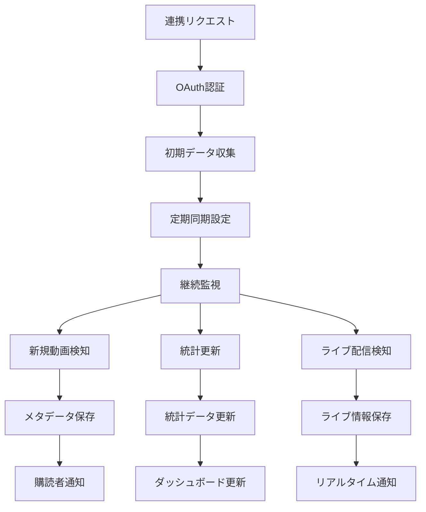

---

spec_id: ING-PIPE-OCR-ONEPAGER

scope: Ingest Pipeline／OCR／スクリーンショット解析

status: draft

source_of_truth: true

last_updated: 2025-11-07 JST

relates:

  - ING-PIPE-CORE-001

  - ING-OCR-IMAGE-002

  - ING-SCREENSHOT-003

  - ING-YT-PIPE-004

owners:

  - pm: Tim

  - impl: Mine

review_flow: AI(ingestプリセット) -> Tim(最終)

---

# 要約（まずここだけ読めばOK）

- **目的：**  

  スターやユーザーがアップした「レシート」「スクショ」「YouTube履歴」を安全・正確に取り込む。  

  同じ画像や個人情報を誤って共有しないよう、全工程を自動チェック。

- **核となる機能：**

  ① 重複防止（checksum／phash）  

  ② PII自動マスキング（個人情報を隠す）  

  ③ OCR解析＋信頼度閾値  

  ④ タイムアウト時のみ再試行  

  ⑤ 全操作を監査ログに残す

---

## パイプライン概要（非エンジニア向け）

1. 画像やスクショをアップすると、まず**重複判定**。  

   → 同じ内容（phash閾値95%以上）は**弾かれる**。

2. 次に**OCR解析**。  

   - 文字抽出後、信頼度が70%未満なら再解析を1回まで。  

   - メール・電話・住所は `<PII:*>` に置換。

3. 解析結果をSupabaseへ保存。  

   - **署名URL（60秒）**で購読者だけが閲覧できる。  

   - 閲覧・再試行・失敗もすべて `audit_ingest` に記録。

`code_refs:` ingest function / OCR worker / phash util : `<TODO>`

---

## 冪等性・再試行ルール

- **冪等性:** 同じファイル名＋サイズ＋hash は1回だけ記録  

- **再試行:** TIMEOUT のみ指数バックオフ（3回上限）  

- **例外:** 認証エラー／APIキー不備は再試行しない

`code_refs:` retry logic / error enum : `<TODO>`

---

## PIIマスキング（対象・除外）

| 種類 | 正規表現例 | 置換後 | 備考 |

|:--|:--|:--|:--|

| メール | `[A-Z0-9._%+-]+@[A-Z0-9.-]+` | `<PII:EMAIL>` | |

| 電話番号 | `0\d{1,4}-\d{1,4}-\d{4}` | `<PII:TEL>` | |

| 住所 | `〒?\d{3}-\d{4}` など | `<PII:ADDR>` | |

| 除外 | SNSハンドル・商品名 | - | 変換しない |

`code_refs:` pii_mask util : `<TODO>`

---

## 監査ログ（audit_ingest）

| 列名 | 型 | 説明 |

|:--|:--|:--|

| id | uuid | 一意ID |

| user_id | uuid | 実行者 |

| source_type | text | receipt / screenshot / youtube |

| result | jsonb | 解析結果 |

| duration_ms | int | 処理時間 |

| retries | int | 再試行回数 |

| error | text | 最終エラー内容 |

| created_at | timestamptz | 記録時刻 |

`code_refs:` audit_ingest schema : `<TODO>`

---

## テレメトリ（可視化）

- 成功率・平均処理時間・再試行率をダッシュボード化  

- Cloudflare Analytics + Supabase Log Export で自動収集  

- 閾値逸脱は Slack 通知

`code_refs:` telemetry config : `<TODO>`

---

## この1ページのゴール

データ取り込みが「**二度と同じ画像を登録しない／個人情報を残さない／障害が追える**」状態に。  

4本の Ingest 仕様を `source_of_truth:true` に昇格し、Day3完了＝仕様20本コンプリートへ。

---

# YouTubeデータ連携パイプライン仕様

## 目的 / スコープ

- YouTube動画のメタデータと視聴履歴を安全かつ効率的に収集・解析
- スターのYouTube活動を購読者に提供するためのデータパイプラインを構築

## YouTube API統合

### APIエンドポイント
- **Data API v3**: チャンネル情報・動画メタデータの取得
- **Analytics API**: 視聴統計・エンゲージメントデータの取得
- **Live Streaming API**: ライブ配信情報の取得

### 認証方式
- **OAuth 2.0**: ユーザーのYouTubeアカウント連携
- **APIキー**: パブリックデータの取得
- **Service Account**: サーバーサイド処理

## データ収集対象

### チャンネル情報
- **基本情報**: チャンネル名、説明、登録者数、総視聴数
- **統計情報**: 動画数、平均視聴時間、トップ動画
- **メタデータ**: 作成日、カテゴリ、言語設定

### 動画情報
- **基本メタデータ**: タイトル、説明、公開日時、タグ
- **統計情報**: 視聴回数、高評価、低評価、コメント数
- **技術情報**: 解像度、長さ、ファイル形式
- **エンゲージメント**: いいね、共有、保存数

### 視聴履歴
- **履歴データ**: 視聴日時、視聴時間、デバイス情報
- **プレイリスト**: 保存済みプレイリストと動画
- **検索履歴**: 検索クエリとクリック履歴
- **購読情報**: 購読チャンネル一覧

## 処理フロー



## データモデル

### youtube_channels テーブル
```sql
CREATE TABLE youtube_channels (
  id uuid PRIMARY KEY DEFAULT gen_random_uuid(),
  user_id uuid NOT NULL REFERENCES auth.users(id),
  channel_id text UNIQUE NOT NULL,
  channel_title text NOT NULL,
  channel_description text,
  subscriber_count bigint,
  video_count integer,
  view_count bigint,
  created_at timestamptz DEFAULT now(),
  updated_at timestamptz DEFAULT now()
);
```

### youtube_videos テーブル
```sql
CREATE TABLE youtube_videos (
  id uuid PRIMARY KEY DEFAULT gen_random_uuid(),
  channel_id uuid REFERENCES youtube_channels(id),
  video_id text UNIQUE NOT NULL,
  title text NOT NULL,
  description text,
  published_at timestamptz NOT NULL,
  duration interval,
  view_count bigint DEFAULT 0,
  like_count bigint DEFAULT 0,
  comment_count bigint DEFAULT 0,
  tags text[],
  thumbnail_url text,
  created_at timestamptz DEFAULT now(),
  updated_at timestamptz DEFAULT now()
);
```

### youtube_watch_history テーブル
```sql
CREATE TABLE youtube_watch_history (
  id uuid PRIMARY KEY DEFAULT gen_random_uuid(),
  user_id uuid NOT NULL REFERENCES auth.users(id),
  video_id text NOT NULL,
  watched_at timestamptz NOT NULL,
  watch_duration interval,
  device_type text,
  watch_percentage decimal(5,2),
  created_at timestamptz DEFAULT now()
);
```

## 同期戦略

### 初期同期
- **全量取得**: チャンネル作成時の過去動画一括取得
- **優先度**: 最新動画から過去3ヶ月分を優先
- **バッチ処理**: 50件単位でのAPIコール

### 定期同期
- **増分更新**: 新規動画・統計更新の検知
- **頻度**: 6時間おき（APIクォータ考慮）
- **リアルタイム**: Webhookによる即時通知（プレミアム機能）

### ライブ配信対応
- **スケジュール検知**: ライブ配信予定の自動検知
- **開始通知**: 配信開始時のリアルタイム通知
- **統計追跡**: 同時視聴者数・チャット参加者数

## PII保護・プライバシー

### データフィルタリング
- **個人情報除去**: コメント内の個人情報自動検出
- **アクセス制御**: 購読者のみ自身の履歴閲覧許可
- **データ保持**: 必要最小限の期間のみ保存

### 同意管理
- **明確な同意**: YouTube連携時の詳細説明
- **権限範囲**: 最小限のAPIスコープ要求
- **撤回機能**: いつでも連携解除可能

## エラー処理・再試行

### APIエラー対応
- **クォータ超過**: 指数バックオフで再試行
- **認証エラー**: ユーザーへの再認証要求
- **コンテンツ不存在**: 削除動画の適切処理

### ネットワーク障害
- **タイムアウト**: 3回までの再試行
- **接続エラー**: バックオフ戦略適用
- **データ破損**: チェックサム検証

## パフォーマンス最適化

### API効率化
- **バッチリクエスト**: 複数動画の一括取得
- **差分取得**: 前回同期からの変更のみ取得
- **キャッシュ**: API結果の適切なキャッシュ

### データベース最適化
- **インデックス**: 頻繁なクエリに対する最適化
- **パーティション**: 大量データの時間ベース分割
- **アーカイブ**: 古いデータの自動アーカイブ

## セキュリティ

### APIセキュリティ
- **トークン管理**: アクセストークンの安全な保存
- **リフレッシュ**: 自動トークン更新
- **監査**: 全APIアクセスのログ記録

### データセキュリティ
- **暗号化**: 保存データの暗号化
- **アクセス制御**: RLSによる厳格な権限管理
- **匿名化**: 不要な個人情報の除去

## 監視・運用

### メトリクス収集
- API使用量とクォータ残量
- 同期成功率と遅延時間
- データ鮮度と完全性
- ユーザー利用統計

### アラート設定
- APIクォータ残量警告（80%使用）
- 同期遅延（6時間以上）
- データ不整合検知
- エラー率上昇

## テスト戦略

### 単体テスト
- APIクライアントの正確性
- データ変換ロジックの検証
- エラーハンドリングの完全性

### 統合テスト
- OAuthフロー全体の検証
- データ同期プロセスの確認
- Webhook処理の正確性

### E2Eテスト
- 実際のYouTubeチャンネル連携
- 動画データ取得と表示
- 購読者権限でのアクセス制御

## コンプライアンス

### YouTube API規約
- **レート制限遵守**: APIクォータの厳守
- **データ使用**: 許可された範囲内のみ使用
- **プライバシー**: GDPR・CCPA準拠

### プラットフォーム規約
- **公正使用**: 著作権コンテンツの適切処理
- **コンテンツポリシー**: YouTube利用規約遵守
- **年齢制限**: 18歳未満コンテンツの適切処理
