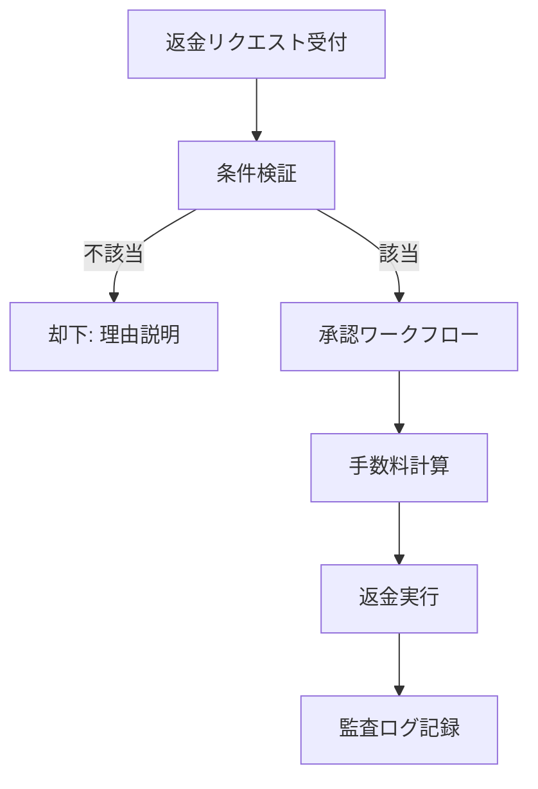

---

spec_id: PAY-STR-RLS-ONEPAGER

scope: Stripe決済／RLSアクセス制御／共通返金ポリシー

status: draft

source_of_truth: true

last_updated: 2025-11-07 JST

relates:

  - PAY-STR-WEBHOOK

  - PAY-STR-AUDIT

  - PAY-STR-SUBSCRIPTION

  - RLS-ACCESS-POLICY

  - RLS-STORAGE

  - RLS-ROLE-MATRIX

  - REFUND-POLICY

owners:

  - pm: Tim

  - impl: Mine

review_flow: AI(stripe_rlsプリセット) -> Tim(最終)

---

# 要約（まずここだけ読めばOK）

- **Stripeでできること：**

  クレジットカード・Apple Pay・Google Payで安全に購読決済できる。  

  成功後はスターの有料情報を見られる（サブスク型／単発課金どちらも対応）。

- **返金ポリシー：**

  原則不可。ただし二重請求やシステム障害など、当社責任の場合は全額返金。  

  → 文言はキャリア決済と完全に統一。

- **安全設計の要：**

  ① Webhookの重複防止  

  ② 監査ログによる全履歴記録  

  ③ RLSでアクセス範囲を厳密に制御

---

## Stripe側の仕組み（3点だけ）

1. **Webhook重複防止：**  

   Stripeから同じイベントIDが複数届いても、**1回しか処理されない**  

   → `event.id` に UNIQUE制約＋idempotent upsert

2. **監査ログ：**  

   すべての通知イベントを `audit_payments` に保存（原文JSON・署名結果・回数・タイムスタンプ）  

   → このテーブルが**唯一の信頼記録**

3. **サブスク状態同期：**  

   定期課金の「有効／停止」を Supabase のユーザ権限に反映（RLSと連携）

`code_refs:` webhook handler / audit schema / cron job : `<TODO>`

---

## RLS（行レベルセキュリティ）設計

| ロール | 読み取り | 書き込み | ストレージ閲覧 | 備考 |

|:--|:--:|:--:|:--:|:--|

| anonymous | ✖ | ✖ | ✖ | ログイン前 |

| free_user | 一部可 | ✖ | ✖ | 無料スター情報のみ |

| paid_user | ◎ | 一部 | ◎ | 自分が購読したスターの範囲のみ |

| star | ◎ | ◎ | ◎ | 自分の投稿・売上のみ |

| admin | ◎ | ◎ | ◎ | 全件管理権限 |

- 署名URL寿命：**60秒**（購読者のみ付与）  

- 管理権限操作はすべて**監査対象**

`code_refs:` RLS policy SQL / storage policy : `<TODO>`

---

## 返金ポリシー（キャリア決済と共通）

- 原則返金不可  

- 当社原因（重複課金・決済障害）は全額返金  

- 返金は**監査ログ＋Stripe Dashboard記録**で照合後、Stripe APIで処理  

- ポリシー文言は PAY-CAR-POLICY と**完全一致**させること

`code_refs:` policy text / refund handler : `<TODO>`

---

## ログ・計測

- Stripeイベント件数／再送件数／平均反映時間／返金件数 を収集  

- 90日で自動アーカイブ  

- メトリクスは Prometheus + Grafana で可視化

`code_refs:` metrics exporter : `<TODO>`

---

## この1ページのゴール

Stripe／RLS／返金ポリシーが**同じ思想・同じ言葉**で動いている状態を保証。  

ここに矛盾がなければ、関連7仕様を `source_of_truth:true` に昇格可能。

---

---
doc_id: PAY-POLICY-COMMON-001
domain: payment_policy
status: draft
source_of_truth: true
owner: tim
code_refs:
  - lib/features/payment/policies/refund_policy.dart#L1-L150
  - supabase/tables/refund_requests.sql#L1-L200
  - docs/legal/refund_policy.md#L1-L100
last_updated: 2025-11-07
---

# 決済共通：返金ポリシー運用

## 目的 / スコープ

- Stripe決済とキャリア決済の両方で統一された返金ポリシーを適用。
- 原則返金不可を明文化し、やむを得ない例外時の運用手順を定義。
- 監査ログで透明性を確保し、法的リスクを最小化。

## 基本方針

### 原則：返金不可
**デジタルコンテンツの性質上、購入後の返金は原則としてお受けできません。**
- 利用規約第X条に基づく
- コンテンツ消費後のキャンセル不可
- 定期購読の途中解約不可

### 例外条件
以下の条件をすべて満たす場合のみ返金対象：
1. **未使用状態**: 購入後7日以内、コンテンツ未消費
2. **システム障害**: 当社システムのバグ/障害による二重決済
3. **法的要請**: 裁判所命令、消費者契約法等の法的根拠
4. **証拠提出**: 返金理由を裏付ける証拠の提出

## 返金プロセス

## 手数料体系

### Stripe決済
- **返金手数料**: 返金額の10% or ¥500（高い方）
- **Stripe手数料**: 別途Stripeの返金手数料が発生
- **為替手数料**: 海外決済の場合

### キャリア決済
- **返金手数料**: 返金額の10% or ¥500（高い方）
- **キャリア手数料**: キャリア側の返金手数料が発生
- **事務手数料**: ¥300（固定）

## 運用フロー

### ユーザー申請
1. **サポート窓口**: メール/チャットで返金申請
2. **必要情報**: 決済ID、返金理由、証拠資料
3. **受付確認**: 24時間以内に受付メール送信

### 審査プロセス
1. **一次審査**: 自動チェック（期間/使用状況）
2. **二次審査**: 担当者確認（証拠検証）
3. **承認会議**: 高額/疑義ケースは会議承認
4. **執行**: 承認後3営業日以内に返金

### 返金実行
1. **元決済経路**: 同じ決済方法で返金
2. **手数料控除**: 返金額から手数料を差し引き
3. **完了通知**: 返金完了メール送信
4. **領収書**: 返金領収書の発行

## 監査・ログ

### 必須ログ項目
- **申請ログ**: user_id, payment_id, reason, evidence_urls, timestamp
- **審査ログ**: reviewer_id, decision, reason, timestamp
- **実行ログ**: refund_id, amount, fee, method, timestamp
- **監査ログ**: 全操作のwho/what/when/why

### 保存期間
- **申請/審査ログ**: 7年（法定保存期間）
- **実行ログ**: 10年（税務関連）
- **個人情報**: 最小限のみ、要匿名化

## エラーケース

### 却下パターン
- **期間超過**: 「返金対象期間（7日）を過ぎています」
- **使用済み**: 「コンテンツが既に消費されています」
- **証拠不足**: 「返金条件を満たす証拠が不十分です」
- **重複申請**: 「既に返金処理済みです」

### 例外処理
- **システム障害**: 開発チーム調査、特別対応
- **法的要請**: 法的根拠確認、優先処理
- **誤処理**: 内部調査、是正措置

## UI/UX考慮

### 返金依頼フォーム
- **明確な条件提示**: 「7日以内、未使用の場合のみ対象」
- **必要な情報**: 決済ID、理由、証拠ファイル
- **見積もり表示**: 「返金予定額: ¥X,XXX（手数料: ¥XXX）」

### ステータス表示
- **申請中**: 「返金申請を審査中です」
- **承認待ち**: 「返金条件を満たしています。承認までお待ちください」
- **却下**: 「申し訳ありませんが、返金条件を満たしていません」
- **完了**: 「返金処理が完了しました」

## テストケース

### 正常系
- 期間内未使用の返金申請→承認→返金実行
- システム障害による二重決済→特別返金

### 異常系
- 期間超過申請→自動却下
- 証拠不足→手動却下
- 重複申請→警告表示

### エッジケース
- 返金中の再申請
- 部分返金（複数決済）
- 海外ユーザー（為替考慮）

## セキュリティ/PII

- **最小情報**: 返金に必要な最小限の個人情報のみ
- **暗号化**: 証拠ファイルの安全保存
- **ログ**: PIIの匿名化処理
- **アクセス制御**: 返金担当者のみアクセス可能
