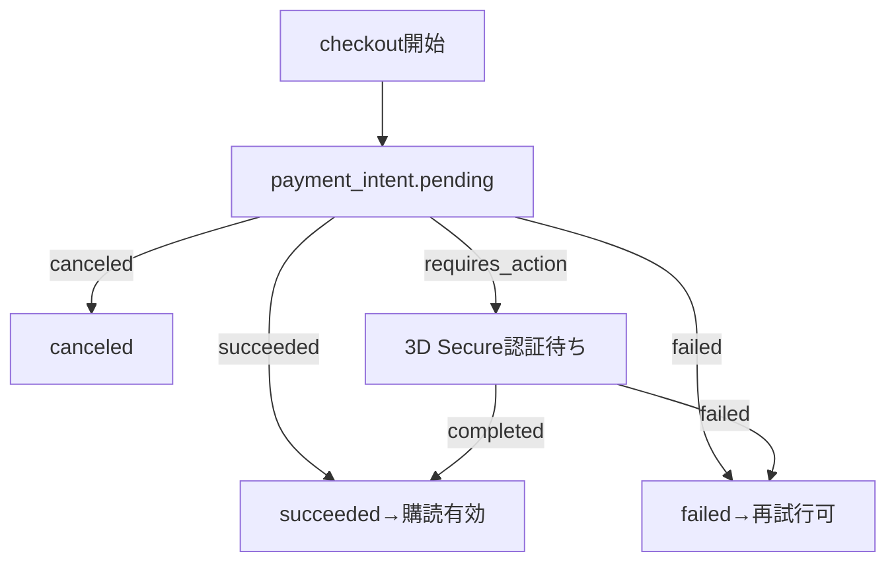

---

spec_id: PAY-STR-RLS-ONEPAGER

scope: Stripe決済／RLSアクセス制御／共通返金ポリシー

status: draft

source_of_truth: true

last_updated: 2025-11-07 JST

relates:

  - PAY-STR-WEBHOOK

  - PAY-STR-AUDIT

  - PAY-STR-SUBSCRIPTION

  - RLS-ACCESS-POLICY

  - RLS-STORAGE

  - RLS-ROLE-MATRIX

  - REFUND-POLICY

owners:

  - pm: Tim

  - impl: Mine

review_flow: AI(stripe_rlsプリセット) -> Tim(最終)

---

# 要約（まずここだけ読めばOK）

- **Stripeでできること：**

  クレジットカード・Apple Pay・Google Payで安全に購読決済できる。  

  成功後はスターの有料情報を見られる（サブスク型／単発課金どちらも対応）。

- **返金ポリシー：**

  原則不可。ただし二重請求やシステム障害など、当社責任の場合は全額返金。  

  → 文言はキャリア決済と完全に統一。

- **安全設計の要：**

  ① Webhookの重複防止  

  ② 監査ログによる全履歴記録  

  ③ RLSでアクセス範囲を厳密に制御

---

## Stripe側の仕組み（3点だけ）

1. **Webhook重複防止：**  

   Stripeから同じイベントIDが複数届いても、**1回しか処理されない**  

   → `event.id` に UNIQUE制約＋idempotent upsert

2. **監査ログ：**  

   すべての通知イベントを `audit_payments` に保存（原文JSON・署名結果・回数・タイムスタンプ）  

   → このテーブルが**唯一の信頼記録**

3. **サブスク状態同期：**  

   定期課金の「有効／停止」を Supabase のユーザ権限に反映（RLSと連携）

`code_refs:` webhook handler / audit schema / cron job : `<TODO>`

---

## RLS（行レベルセキュリティ）設計

| ロール | 読み取り | 書き込み | ストレージ閲覧 | 備考 |

|:--|:--:|:--:|:--:|:--|

| anonymous | ✖ | ✖ | ✖ | ログイン前 |

| free_user | 一部可 | ✖ | ✖ | 無料スター情報のみ |

| paid_user | ◎ | 一部 | ◎ | 自分が購読したスターの範囲のみ |

| star | ◎ | ◎ | ◎ | 自分の投稿・売上のみ |

| admin | ◎ | ◎ | ◎ | 全件管理権限 |

- 署名URL寿命：**60秒**（購読者のみ付与）  

- 管理権限操作はすべて**監査対象**

`code_refs:` RLS policy SQL / storage policy : `<TODO>`

---

## 返金ポリシー（キャリア決済と共通）

- 原則返金不可  

- 当社原因（重複課金・決済障害）は全額返金  

- 返金は**監査ログ＋Stripe Dashboard記録**で照合後、Stripe APIで処理  

- ポリシー文言は PAY-CAR-POLICY と**完全一致**させること

`code_refs:` policy text / refund handler : `<TODO>`

---

## ログ・計測

- Stripeイベント件数／再送件数／平均反映時間／返金件数 を収集  

- 90日で自動アーカイブ  

- メトリクスは Prometheus + Grafana で可視化

`code_refs:` metrics exporter : `<TODO>`

---

## この1ページのゴール

Stripe／RLS／返金ポリシーが**同じ思想・同じ言葉**で動いている状態を保証。  

ここに矛盾がなければ、関連7仕様を `source_of_truth:true` に昇格可能。

---

---
doc_id: PAY-STR-CORE-001
domain: payment_stripe
status: draft
source_of_truth: true
owner: mine
code_refs:
  - lib/features/payment/stripe_checkout.dart#L1-L160
  - supabase/functions/stripe/webhook/index.ts#L1-L200
  - supabase/tables/payments.sql#L1-L150
last_updated: 2025-11-07
---

# Stripe決済：サブスクリプション・PPV共通フロー

## 目的 / スコープ

- スター単位の課金をStripeで処理し、**重複課金を防止しつつWebhookで状態を正確に同期**する。
- 3D Secure認証・多重タップ対策・通信切断時の復帰をサポート。

## 状態遷移 / フロー

* **Idempotency-Key**: `(user_id, star_id, plan_id, timestamp)` で生成・保持。
* **Webhook検証**: Stripe署名チェック＋event_id重複防止。
* **二重課金防止**: DBユニーク制約＋intent再利用。
* **3D Secure**: requires_action時のUI誘導。

## 入出力 / 依存

* **Inputs**: `user_id, star_id, plan_id, success_url, cancel_url`
* **Outputs**: `payment_intent{ id, client_secret, status }`
* **依存**: Stripe SDK, Supabase(RLS/Edge), Webhookエンドポイント

## エラーと例外

* `card_declined`: 「カードが拒否されました。別のカードをお試しください」
* `requires_action`: 「追加認証が必要です。3D Secure認証を行ってください」
* `insufficient_funds`: 「残高不足です」
* `expired_card`: 「有効期限切れのカードです」

## Webhook処理

* **署名検証**: `stripe-signature` ヘッダーをsecretで検証
* **イベント重複防止**: `event_id` のユニーク制約
* **状態同期**: payment_intent.succeeded/failed でDB更新
* **再送処理**: idempotentに処理（同じevent_idはスキップ）

## 返金/ポリシー

* **原則返金不可**: 利用規約に基づく（デジタルコンテンツの性質）
* **例外条件**: 
  - 二重決済（システム障害）
  - 法的要請
  - 未使用期間7日以内
* **手数料**: 返金額の10% or ¥500（高い方）

## 計測・監査

* **成功率**: (succeeded / total_intents) × 100
* **失敗理由別**: card_declined, insufficient_funds, etc.
* **監査ログ**: 全webhookイベントを保存
  - event_id, payment_intent_id, user_id, amount, currency, status

## セキュリティ/PII

* **トークン化**: カード情報はStripeにのみ保持（PCI DSS準拠）
* **ログ**: PAN/CVC/有効期限を一切保存しない
* **Webhook**: 署名検証済みイベントのみ処理

## テスト（受入）

* **正常フロー**: checkout → succeeded → 購読有効
* **3D Secure**: requires_action → 認証完了 → succeeded
* **失敗ケース**: card_declined → 適切なエラーメッセージ
* **Webhook**: 再送・順序違い・重複イベントの処理
* **二重防止**: 連打・別タブ同時購入の排他
