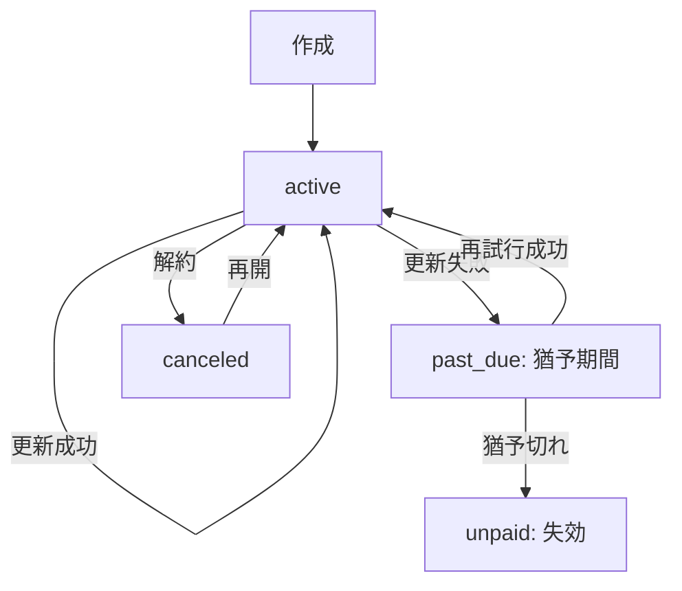

---

spec_id: PAY-STR-RLS-ONEPAGER

scope: Stripe決済／RLSアクセス制御／共通返金ポリシー

status: draft

source_of_truth: true

last_updated: 2025-11-07 JST

relates:

  - PAY-STR-WEBHOOK

  - PAY-STR-AUDIT

  - PAY-STR-SUBSCRIPTION

  - RLS-ACCESS-POLICY

  - RLS-STORAGE

  - RLS-ROLE-MATRIX

  - REFUND-POLICY

owners:

  - pm: Tim

  - impl: Mine

review_flow: AI(stripe_rlsプリセット) -> Tim(最終)

---

# 要約（まずここだけ読めばOK）

- **Stripeでできること：**

  クレジットカード・Apple Pay・Google Payで安全に購読決済できる。  

  成功後はスターの有料情報を見られる（サブスク型／単発課金どちらも対応）。

- **返金ポリシー：**

  原則不可。ただし二重請求やシステム障害など、当社責任の場合は全額返金。  

  → 文言はキャリア決済と完全に統一。

- **安全設計の要：**

  ① Webhookの重複防止  

  ② 監査ログによる全履歴記録  

  ③ RLSでアクセス範囲を厳密に制御

---

## Stripe側の仕組み（3点だけ）

1. **Webhook重複防止：**  

   Stripeから同じイベントIDが複数届いても、**1回しか処理されない**  

   → `event.id` に UNIQUE制約＋idempotent upsert

2. **監査ログ：**  

   すべての通知イベントを `audit_payments` に保存（原文JSON・署名結果・回数・タイムスタンプ）  

   → このテーブルが**唯一の信頼記録**

3. **サブスク状態同期：**  

   定期課金の「有効／停止」を Supabase のユーザ権限に反映（RLSと連携）

`code_refs:` webhook handler / audit schema / cron job : `<TODO>`

---

## RLS（行レベルセキュリティ）設計

| ロール | 読み取り | 書き込み | ストレージ閲覧 | 備考 |

|:--|:--:|:--:|:--:|:--|

| anonymous | ✖ | ✖ | ✖ | ログイン前 |

| free_user | 一部可 | ✖ | ✖ | 無料スター情報のみ |

| paid_user | ◎ | 一部 | ◎ | 自分が購読したスターの範囲のみ |

| star | ◎ | ◎ | ◎ | 自分の投稿・売上のみ |

| admin | ◎ | ◎ | ◎ | 全件管理権限 |

- 署名URL寿命：**60秒**（購読者のみ付与）  

- 管理権限操作はすべて**監査対象**

`code_refs:` RLS policy SQL / storage policy : `<TODO>`

---

## 返金ポリシー（キャリア決済と共通）

- 原則返金不可  

- 当社原因（重複課金・決済障害）は全額返金  

- 返金は**監査ログ＋Stripe Dashboard記録**で照合後、Stripe APIで処理  

- ポリシー文言は PAY-CAR-POLICY と**完全一致**させること

`code_refs:` policy text / refund handler : `<TODO>`

---

## ログ・計測

- Stripeイベント件数／再送件数／平均反映時間／返金件数 を収集  

- 90日で自動アーカイブ  

- メトリクスは Prometheus + Grafana で可視化

`code_refs:` metrics exporter : `<TODO>`

---

## この1ページのゴール

Stripe／RLS／返金ポリシーが**同じ思想・同じ言葉**で動いている状態を保証。  

ここに矛盾がなければ、関連7仕様を `source_of_truth:true` に昇格可能。

---

---
doc_id: PAY-STR-SUBS-002
domain: payment_stripe
status: draft
source_of_truth: true
owner: mine
code_refs:
  - lib/features/payment/stripe_subscription.dart#L1-L200
  - supabase/functions/stripe/subscription_webhook.ts#L1-L180
  - supabase/tables/subscriptions.sql#L1-L120
last_updated: 2025-11-07
---

# Stripeサブスクリプション：継続課金管理

## 目的 / スコープ

- 月額/年額の継続課金をStripe Subscriptionで管理し、自動更新・解約・プラン変更をサポート。
- 猶予期間・再試行・最終失効のライフサイクルを明確に制御。

## 状態遷移 / フロー



* **猶予期間**: past_due状態で7日間、再試行を3回
* **失効**: unpaid状態で30日後に完全削除
* **再開**: canceledからactiveに戻す（新しいsubscription作成）

## 入出力 / 依存

* **Inputs**: `user_id, star_id, plan_id, trial_days?, proration?`
* **Outputs**: `subscription{ id, status, current_period_start/end, cancel_at }`
* **依存**: Stripe Billing, Supabase(subscriptionsテーブル), Webhook

## プラン変更（Proration）

* **即時変更**: 差額を当期請求（クレジット/デビット）
* **期末変更**: 次回更新時から適用
* **ダウングレード**: 差額をクレジットとして保持

## Webhookイベント処理

* `customer.subscription.created`: 初期作成
* `customer.subscription.updated`: 状態変更/プラン変更
* `invoice.payment_succeeded`: 課金成功
* `invoice.payment_failed`: 課金失敗（再試行開始）
* `customer.subscription.deleted`: 解約完了

## キャンセル実装ルール（確定案）
  
    「**自動更新を停止**」＝**今期末まで閲覧可**、**次回以降は課金しない**。
    
    （＝Stripe: `cancel_at_period_end = true`／キャリア: 事業者規約に合わせて"次回以降停止"）
    
  * **できないこと（原則）**：
    
    即時停止＋当期返金（※例外はサポート裁量。根拠ログ必須）
    
  * **可視化ルール**：
    
    * 新規購読 → **即時可視化**（支払成功／承認で権限ON）
    
    * 自動更新停止 → **period_end まで可視**、**期日到達で不可視**（自動）
    
  ### 2) サポート例外（やむを得ない理由のみ）
    
  * **即時停止（サポ断）**：当日で不可視化（返金有無はケース別）
    
    例）重複課金／明確な事業者起因障害／不正利用（請求元盗用 等）
    
  * **返金判断**：
    
    * 原則不可
    
    * **当社起因**（二重請求・システム障害等）は**全額返金**
    
    * 実務は**監査ログ（audit_payments）**を根拠に。返金時は**監査ID紐づけ必須**
    
  * **監査**：`audit_entitlements` に「誰が・いつ・どの理由で即時停止したか」を必ず記録|

  
    「**自動更新を停止**」＝**今期末まで閲覧可**、**次回以降は課金しない**。
    
    （＝Stripe: `cancel_at_period_end = true`／キャリア: 事業者規約に合わせて"次回以降停止"）
    
  * **できないこと（原則）**：
    
    即時停止＋当期返金（※例外はサポート裁量。根拠ログ必須）
    
  * **可視化ルール**：
    
    * 新規購読 → **即時可視化**（支払成功／承認で権限ON）
    
    * 自動更新停止 → **period_end まで可視**、**期日到達で不可視**（自動）
    
  ### 2) サポート例外（やむを得ない理由のみ）
    
  * **即時停止（サポ断）**：当日で不可視化（返金有無はケース別）
    
    例）重複課金／明確な事業者起因障害／不正利用（請求元盗用 等）
    
  * **返金判断**：
    
    * 原則不可
    
    * **当社起因**（二重請求・システム障害等）は**全額返金**
    
    * 実務は**監査ログ（audit_payments）**を根拠に。返金時は**監査ID紐づけ必須**
    
  * **監査**：`audit_entitlements` に「誰が・いつ・どの理由で即時停止したか」を必ず記録|
### 1) 基本方針（標準）
  
    「**自動更新を停止**」＝**今期末まで閲覧可**、**次回以降は課金しない**。
    
    （＝Stripe: `cancel_at_period_end = true`／キャリア: 事業者規約に合わせて"次回以降停止"）
    
  * **できないこと（原則）**：
    
    即時停止＋当期返金（※例外はサポート裁量。根拠ログ必須）
    
  * **可視化ルール**：
    
    * 新規購読 → **即時可視化**（支払成功／承認で権限ON）
    
    * 自動更新停止 → **period_end まで可視**、**期日到達で不可視**（自動）
    
  ### 2) サポート例外（やむを得ない理由のみ）
    
  * **即時停止（サポ断）**：当日で不可視化（返金有無はケース別）
    
    例）重複課金／明確な事業者起因障害／不正利用（請求元盗用 等）
    
  * **返金判断**：
    
    * 原則不可
    
    * **当社起因**（二重請求・システム障害等）は**全額返金**
    
    * 実務は**監査ログ（audit_payments）**を根拠に。返金時は**監査ID紐づけ必須**
    
  * **監査**：`audit_entitlements` に「誰が・いつ・どの理由で即時停止したか」を必ず記録|

  
    「**自動更新を停止**」＝**今期末まで閲覧可**、**次回以降は課金しない**。
    
    （＝Stripe: `cancel_at_period_end = true`／キャリア: 事業者規約に合わせて"次回以降停止"）
    
  * **できないこと（原則）**：
    
    即時停止＋当期返金（※例外はサポート裁量。根拠ログ必須）
    
  * **可視化ルール**：
    
    * 新規購読 → **即時可視化**（支払成功／承認で権限ON）
    
    * 自動更新停止 → **period_end まで可視**、**期日到達で不可視**（自動）
    
  ### 2) サポート例外（やむを得ない理由のみ）
    
  * **即時停止（サポ断）**：当日で不可視化（返金有無はケース別）
    
    例）重複課金／明確な事業者起因障害／不正利用（請求元盗用 等）
    
  * **返金判断**：
    
    * 原則不可
    
    * **当社起因**（二重請求・システム障害等）は**全額返金**
    
    * 実務は**監査ログ（audit_payments）**を根拠に。返金時は**監査ID紐づけ必須**
    
  * **監査**：`audit_entitlements` に「誰が・いつ・どの理由で即時停止したか」を必ず記録|
* **ユーザー操作でできること**：
  
    「**自動更新を停止**」＝**今期末まで閲覧可**、**次回以降は課金しない**。
    
    （＝Stripe: `cancel_at_period_end = true`／キャリア: 事業者規約に合わせて"次回以降停止"）
    
  * **できないこと（原則）**：
    
    即時停止＋当期返金（※例外はサポート裁量。根拠ログ必須）
    
  * **可視化ルール**：
    
    * 新規購読 → **即時可視化**（支払成功／承認で権限ON）
    
    * 自動更新停止 → **period_end まで可視**、**期日到達で不可視**（自動）
    
  ### 2) サポート例外（やむを得ない理由のみ）
    
  * **即時停止（サポ断）**：当日で不可視化（返金有無はケース別）
    
    例）重複課金／明確な事業者起因障害／不正利用（請求元盗用 等）
    
  * **返金判断**：
    
    * 原則不可
    
    * **当社起因**（二重請求・システム障害等）は**全額返金**
    
    * 実務は**監査ログ（audit_payments）**を根拠に。返金時は**監査ID紐づけ必須**
    
  * **監査**：`audit_entitlements` に「誰が・いつ・どの理由で即時停止したか」を必ず記録|

  
    「**自動更新を停止**」＝**今期末まで閲覧可**、**次回以降は課金しない**。
    
    （＝Stripe: `cancel_at_period_end = true`／キャリア: 事業者規約に合わせて"次回以降停止"）
    
  * **できないこと（原則）**：
    
    即時停止＋当期返金（※例外はサポート裁量。根拠ログ必須）
    
  * **可視化ルール**：
    
    * 新規購読 → **即時可視化**（支払成功／承認で権限ON）
    
    * 自動更新停止 → **period_end まで可視**、**期日到達で不可視**（自動）
    
  ### 2) サポート例外（やむを得ない理由のみ）
    
  * **即時停止（サポ断）**：当日で不可視化（返金有無はケース別）
    
    例）重複課金／明確な事業者起因障害／不正利用（請求元盗用 等）
    
  * **返金判断**：
    
    * 原則不可
    
    * **当社起因**（二重請求・システム障害等）は**全額返金**
    
    * 実務は**監査ログ（audit_payments）**を根拠に。返金時は**監査ID紐づけ必須**
    
  * **監査**：`audit_entitlements` に「誰が・いつ・どの理由で即時停止したか」を必ず記録|
  
  ## データモデル／状態遷移
  
  ### Entitlement（購読権限）テーブル
  
  ```sql
  entitlements (
    id                uuid PK,
    user_id           uuid,
    star_id           uuid,
    provider          text,      -- 'stripe' | 'carrier'
    status            text,      -- 'active'|'pending_cancel'|'canceled'|'revoked'|'past_due'
    access_from       timestamptz,
    access_until      timestamptz,   -- 期末（自動停止ならここまで可視）
    will_cancel_at    timestamptz,   -- = period_end（自動更新停止時にセット）
    revoked_at        timestamptz,   -- 例外即時停止時
    termination_reason text,         -- 例外理由（enum/テキスト）
    last_event_id     text,          -- Stripe/キャリアの原本イベントID
    created_at        timestamptz,
    updated_at        timestamptz
  )
  ```
  
  ### 可視/不可視の判定ビュー（RLSが見る"真実"）
  
  ```sql
  view v_entitlements_effective as
  select *,
    case
      when status='revoked' then false
      when now() < access_until then true
      else false
    end as is_visible
  from entitlements;
  ```
  
  * **通常解約**：`status='pending_cancel', `will_cancel_at=period_end`。CRON/Webhookで期日到達→`status='canceled'` & `access_until=will_cancel_at`
  
  * **即時停止（サポ断）**：`status='revoked', `revoked_at=now()`, `access_until=now()`
  
  ### Webhook/同期の要点
  
  * **Stripe**
    
    * 自動更新停止: `subscription.updated(cancel_at_period_end=true)` → `pending_cancel` へ
    
    * 終了: `subscription.deleted` or `status='canceled'` → `canceled` + `access_until=period_end`
  
  * **キャリア**
    
    * 月次/日次の**リコンシリエーション**で `pending_cancel`→`canceled` を確定
    
    * 事業者仕様で「即時停止」がない場合は**常に期末停止**で統一
  
  ## UI/文言（そのまま使える）
  
  ### 設定ページ（自動更新）
  
  * ボタン文言：**「自動更新を停止」**
  
  * 確認モーダル：
    
    * 見出し：**自動更新を停止しますか？**
    
    * 本文：
      
      ```
      いま停止すると、次回から請求は行われません。
      現在の購読は 〈YYYY/MM/DD HH:mm JST〉 まで閲覧できます。
      ※当期の返金は行われません。
      ```
    
    * 主要ボタン：**停止する**／**やめる**
  
  ### プラン表示
  
  * バッジ：`〈YYYY/MM/DD〉まで有効（自動更新オフ）`
  
  ### 即時停止（サポ断）時の通知（テンプレ）
  
  ```
  サポートにて購読を停止しました。閲覧権限はこの時点で終了しています。
  [チケットID: ####-####] ご不明点は本メールにご返信ください。
  ```
  
  ## RLS/セキュリティ
  
  * アプリ側の表示は**必ず** `v_entitlements_effective.is_visible=true` を前提に
  
  * 画像/添付は**署名URL 60秒**・購読者のみ払い出し（Day2と統一）
  
  * 期末や即時停止で**URLは即無効化**（`access_until` を過ぎたら発行不可）
  
  ## スモークテスト（最小で効く3本）
  
  1. **自動更新停止→期末で不可視化**
  
  * 期待：停止直後は閲覧可／`period_end+1秒`で不可視
  
  2. **Stripe再送×3**（停止→更新→終了）
  
  * 期待：`entitlements` は**一貫**、`audit_payments` に履歴は3行
  
  3. **サポ例外：即時停止**
  
  * 期待：停止操作直後に不可視／`audit_entitlements` に理由・操作者・時刻
  
  ## サポート運用（判断フロー）
  
  ```
  ユーザー申告受付
    └─ 監査確認（重複請求？障害影響？）
         ├─ 当社起因 Yes → 即時停止 + 返金（全額） + 監査ID紐づけ
         ├─ 当社起因 No  → 原則は期末停止案内（テンプレ返信）
         └─ 不正/盗用   → 即時停止 + 返金可否はカード会社/キャリア手続に準拠
  ```
  
  **必要証跡**：`audit_payments.event_id`／通信ログ／エラーレポート番号
  
  **記録**：`support_tickets` に「判断根拠」「最終処理」「対応者」を保存
  
  ## 注意（法務ニュアンス）
  
  * デジタル配信は一般に**当期返金対象外**の運用が多いが、**最終判断は自社規約＋法務確認前提**に。
  
  * 表記は**一貫**させる：Day1・Day2の返金文言（句読点・語尾まで）と同一。
## エラーと例外
  
    「**自動更新を停止**」＝**今期末まで閲覧可**、**次回以降は課金しない**。
    
    （＝Stripe: `cancel_at_period_end = true`／キャリア: 事業者規約に合わせて"次回以降停止"）
    
  * **できないこと（原則）**：
    
    即時停止＋当期返金（※例外はサポート裁量。根拠ログ必須）
    
  * **可視化ルール**：
    
    * 新規購読 → **即時可視化**（支払成功／承認で権限ON）
    
    * 自動更新停止 → **period_end まで可視**、**期日到達で不可視**（自動）
    
  ### 2) サポート例外（やむを得ない理由のみ）
    
  * **即時停止（サポ断）**：当日で不可視化（返金有無はケース別）
    
    例）重複課金／明確な事業者起因障害／不正利用（請求元盗用 等）
    
  * **返金判断**：
    
    * 原則不可
    
    * **当社起因**（二重請求・システム障害等）は**全額返金**
    
    * 実務は**監査ログ（audit_payments）**を根拠に。返金時は**監査ID紐づけ必須**
    
  * **監査**：`audit_entitlements` に「誰が・いつ・どの理由で即時停止したか」を必ず記録|

* `incomplete`: 「初期決済が完了していません」
* `incomplete_expired`: 「決済期限が切れました」
* `past_due`: 「未払いがあります。支払い情報を更新してください」

## 監査・計測

* **継続率**: active状態のsubscription数 / 全subscription数
* **解約率**: canceledになったsubscription数 / 全subscription数
* **失敗率**: invoice.payment_failedイベント数 / 全invoice数
* **監査ログ**: 全subscriptionイベントを保存

## セキュリティ/PII

* **subscription_idのみ保存**: 決済情報はStripeに委ねる
* **RLS適用**: 自分のsubscriptionのみ閲覧可能
* **ログ**: 個人情報非保持（user_id/star_idのみ）
