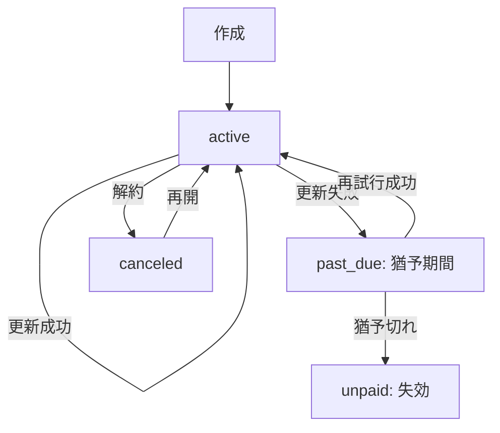

---

spec_id: PAY-STR-RLS-ONEPAGER

scope: Stripe決済／RLSアクセス制御／共通返金ポリシー

status: draft

source_of_truth: true

last_updated: 2025-11-07 JST

relates:

  - PAY-STR-WEBHOOK

  - PAY-STR-AUDIT

  - PAY-STR-SUBSCRIPTION

  - RLS-ACCESS-POLICY

  - RLS-STORAGE

  - RLS-ROLE-MATRIX

  - REFUND-POLICY

owners:

  - pm: Tim

  - impl: Mine

review_flow: AI(stripe_rlsプリセット) -> Tim(最終)

---

# 要約（まずここだけ読めばOK）

- **Stripeでできること：**

  クレジットカード・Apple Pay・Google Payで安全に購読決済できる。  

  成功後はスターの有料情報を見られる（サブスク型／単発課金どちらも対応）。

- **返金ポリシー：**

  原則不可。ただし二重請求やシステム障害など、当社責任の場合は全額返金。  

  → 文言はキャリア決済と完全に統一。

- **安全設計の要：**

  ① Webhookの重複防止  

  ② 監査ログによる全履歴記録  

  ③ RLSでアクセス範囲を厳密に制御

---

## Stripe側の仕組み（3点だけ）

1. **Webhook重複防止：**  

   Stripeから同じイベントIDが複数届いても、**1回しか処理されない**  

   → `event.id` に UNIQUE制約＋idempotent upsert

2. **監査ログ：**  

   すべての通知イベントを `audit_payments` に保存（原文JSON・署名結果・回数・タイムスタンプ）  

   → このテーブルが**唯一の信頼記録**

3. **サブスク状態同期：**  

   定期課金の「有効／停止」を Supabase のユーザ権限に反映（RLSと連携）

`code_refs:` webhook handler / audit schema / cron job : `<TODO>`

---

## RLS（行レベルセキュリティ）設計

| ロール | 読み取り | 書き込み | ストレージ閲覧 | 備考 |

|:--|:--:|:--:|:--:|:--|

| anonymous | ✖ | ✖ | ✖ | ログイン前 |

| free_user | 一部可 | ✖ | ✖ | 無料スター情報のみ |

| paid_user | ◎ | 一部 | ◎ | 自分が購読したスターの範囲のみ |

| star | ◎ | ◎ | ◎ | 自分の投稿・売上のみ |

| admin | ◎ | ◎ | ◎ | 全件管理権限 |

- 署名URL寿命：**60秒**（購読者のみ付与）  

- 管理権限操作はすべて**監査対象**

`code_refs:` RLS policy SQL / storage policy : `<TODO>`

---

## 返金ポリシー（キャリア決済と共通）

- 原則返金不可  

- 当社原因（重複課金・決済障害）は全額返金  

- 返金は**監査ログ＋Stripe Dashboard記録**で照合後、Stripe APIで処理  

- ポリシー文言は PAY-CAR-POLICY と**完全一致**させること

`code_refs:` policy text / refund handler : `<TODO>`

---

## ログ・計測

- Stripeイベント件数／再送件数／平均反映時間／返金件数 を収集  

- 90日で自動アーカイブ  

- メトリクスは Prometheus + Grafana で可視化

`code_refs:` metrics exporter : `<TODO>`

---

## この1ページのゴール

Stripe／RLS／返金ポリシーが**同じ思想・同じ言葉**で動いている状態を保証。  

ここに矛盾がなければ、関連7仕様を `source_of_truth:true` に昇格可能。

---

---
doc_id: PAY-STR-SUBS-002
domain: payment_stripe
status: draft
source_of_truth: true
owner: mine
code_refs:
  - lib/features/payment/stripe_subscription.dart#L1-L200
  - supabase/functions/stripe/subscription_webhook.ts#L1-L180
  - supabase/tables/subscriptions.sql#L1-L120
last_updated: 2025-11-07
---

# Stripeサブスクリプション：継続課金管理

## 目的 / スコープ

- 月額/年額の継続課金をStripe Subscriptionで管理し、自動更新・解約・プラン変更をサポート。
- 猶予期間・再試行・最終失効のライフサイクルを明確に制御。

## 状態遷移 / フロー

* **猶予期間**: past_due状態で7日間、再試行を3回
* **失効**: unpaid状態で30日後に完全削除
* **再開**: canceledからactiveに戻す（新しいsubscription作成）

## 入出力 / 依存

* **Inputs**: `user_id, star_id, plan_id, trial_days?, proration?`
* **Outputs**: `subscription{ id, status, current_period_start/end, cancel_at }`
* **依存**: Stripe Billing, Supabase(subscriptionsテーブル), Webhook

## プラン変更（Proration）

* **即時変更**: 差額を当期請求（クレジット/デビット）
* **期末変更**: 次回更新時から適用
* **ダウングレード**: 差額をクレジットとして保持

## Webhookイベント処理

* `customer.subscription.created`: 初期作成
* `customer.subscription.updated`: 状態変更/プラン変更
* `invoice.payment_succeeded`: 課金成功
* `invoice.payment_failed`: 課金失敗（再試行開始）
* `customer.subscription.deleted`: 解約完了

## 解約フロー

* **即時解約**: cancel_at_period_end=false → 即時停止
* **期末解約**: cancel_at_period_end=true → 期間終了まで有効
* **再開**: canceled状態からresume（新しいsubscription）

## エラーと例外

* `incomplete`: 「初期決済が完了していません」
* `incomplete_expired`: 「決済期限が切れました」
* `past_due`: 「未払いがあります。支払い情報を更新してください」

## 監査・計測

* **継続率**: active状態のsubscription数 / 全subscription数
* **解約率**: canceledになったsubscription数 / 全subscription数
* **失敗率**: invoice.payment_failedイベント数 / 全invoice数
* **監査ログ**: 全subscriptionイベントを保存

## セキュリティ/PII

* **subscription_idのみ保存**: 決済情報はStripeに委ねる
* **RLS適用**: 自分のsubscriptionのみ閲覧可能
* **ログ**: 個人情報非保持（user_id/star_idのみ）
