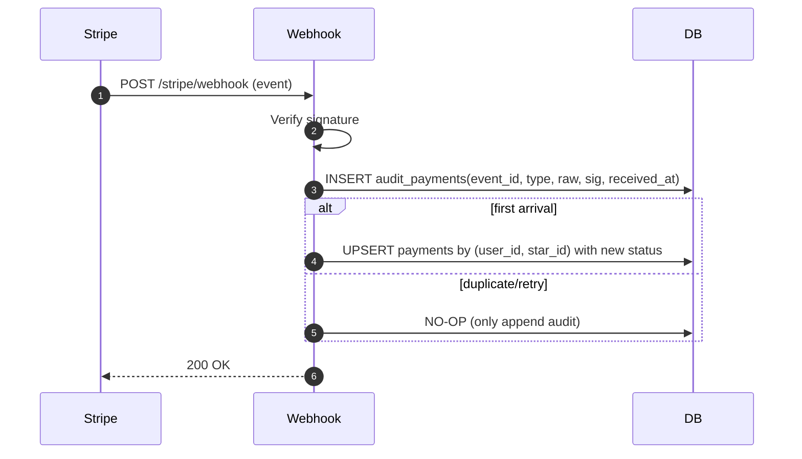

---

spec_id: PAY-STR-RLS-ONEPAGER

scope: Stripe決済／RLSアクセス制御／共通返金ポリシー

status: draft

source_of_truth: true

last_updated: 2025-11-07 JST

relates:

  - PAY-STR-WEBHOOK

  - PAY-STR-AUDIT

  - PAY-STR-SUBSCRIPTION

  - RLS-ACCESS-POLICY

  - RLS-STORAGE

  - RLS-ROLE-MATRIX

  - REFUND-POLICY

owners:

  - pm: Tim

  - impl: Mine

review_flow: AI(stripe_rlsプリセット) -> Tim(最終)

---

# 要約（まずここだけ読めばOK）

- **Stripeでできること：**

  クレジットカード・Apple Pay・Google Payで安全に購読決済できる。  

  成功後はスターの有料情報を見られる（サブスク型／単発課金どちらも対応）。

- **返金ポリシー：**

  原則不可。ただし二重請求やシステム障害など、当社責任の場合は全額返金。  

  → 文言はキャリア決済と完全に統一。

- **安全設計の要：**

  ① Webhookの重複防止  

  ② 監査ログによる全履歴記録  

  ③ RLSでアクセス範囲を厳密に制御

---

## Stripe側の仕組み（3点だけ）

1. **Webhook重複防止：**  

   Stripeから同じイベントIDが複数届いても、**1回しか処理されない**  

   → `event.id` に UNIQUE制約＋idempotent upsert

2. **監査ログ：**  

   すべての通知イベントを `audit_payments` に保存（原文JSON・署名結果・回数・タイムスタンプ）  

   → このテーブルが**唯一の信頼記録**

3. **サブスク状態同期：**  

   定期課金の「有効／停止」を Supabase のユーザ権限に反映（RLSと連携）

`code_refs:` webhook handler / audit schema / cron job : `<TODO>`

---

## RLS（行レベルセキュリティ）設計

| ロール | 読み取り | 書き込み | ストレージ閲覧 | 備考 |

|:--|:--:|:--:|:--:|:--|

| anonymous | ✖ | ✖ | ✖ | ログイン前 |

| free_user | 一部可 | ✖ | ✖ | 無料スター情報のみ |

| paid_user | ◎ | 一部 | ◎ | 自分が購読したスターの範囲のみ |

| star | ◎ | ◎ | ◎ | 自分の投稿・売上のみ |

| admin | ◎ | ◎ | ◎ | 全件管理権限 |

- 署名URL寿命：**60秒**（購読者のみ付与）  

- 管理権限操作はすべて**監査対象**

`code_refs:` RLS policy SQL / storage policy : `<TODO>`

---

## 返金ポリシー（キャリア決済と共通）

- 原則返金不可  

- 当社原因（重複課金・決済障害）は全額返金  

- 返金は**監査ログ＋Stripe Dashboard記録**で照合後、Stripe APIで処理  

- ポリシー文言は PAY-CAR-POLICY と**完全一致**させること

`code_refs:` policy text / refund handler : `<TODO>`

---

## ログ・計測

- Stripeイベント件数／再送件数／平均反映時間／返金件数 を収集  

- 90日で自動アーカイブ  

- メトリクスは Prometheus + Grafana で可視化

`code_refs:` metrics exporter : `<TODO>`

---

## この1ページのゴール

Stripe／RLS／返金ポリシーが**同じ思想・同じ言葉**で動いている状態を保証。  

ここに矛盾がなければ、関連7仕様を `source_of_truth:true` に昇格可能。

---

---
doc_id: PAY-STR-WEBHOOK-003
domain: payment_stripe
status: draft
source_of_truth: true
owner: mine
code_refs:
  - supabase/functions/stripe/webhook/index.ts#L1-L220
  - lib/features/payment/stripe_checkout.dart#L1-L160
  - supabase/tables/payments.sql#L1-L200
  - supabase/tables/audit_payments.sql#L1-L200
last_updated: 2025-11-07
---

# Stripe Webhook 再送対策・監査ログ仕様

## 目的 / スコープ

- Stripe からの **再送（retries）** を含む全イベントを**一意・順序正しく**適用し、**DBの支払い状態を唯一の真実源**として保つ。

- **監査ログ**で who/when/what を完全追跡可能にする（コンプライアンス/サポート/不正検知）。

## 対象イベント

- `payment_intent.succeeded/failed/canceled/processing/requires_action`

- `checkout.session.completed/expired/async_payment_succeeded/async_payment_failed`

- `invoice.payment_succeeded/payment_failed`

- `customer.subscription.created/updated/deleted`

> 仕様の原則：**Webhookが"状態を決め"アプリはこれに従う**（フロントの成功表示よりWebhook優先）。

## セキュリティ

- 署名検証（`Stripe-Signature`）：**必須**、検証失敗は 400。

- エンドポイントは**POSTのみ**受け付け、**idempotency** はDBで保証。

- PIIは保存しない（`event.id`/`customer`/`payment_intent` などのトークン系IDのみ保持）。

## 再送対策（Idempotency）

- **重複排除キー**：`event.id` を `audit_payments.event_id_unique` でユニーク制約。

- ハンドラは**アップサート**で冪等に更新する（例：`payments(status, updated_at, external_txn_id, next_renew_at)`）。

- 受信順序に依存しないよう **状態遷移ルール** を定義（下表）。

### 状態遷移ルール（例）

| 既存状態 | 受信イベント                     | 新状態      | 備考 |

|----------|----------------------------------|-------------|------|

| pending  | `payment_intent.succeeded`       | active      | 購読を有効化、`next_renew_at`計算 |

| pending  | `payment_intent.failed/canceled` | failed      | 再試行UIへ |

| active   | `invoice.payment_failed`         | past_due    | 猶予期間/再試行へ |

| past_due | `invoice.payment_succeeded`      | active      | 自動回復 |

| any      | `checkout.session.expired`       | canceled    | 再開導線を提示 |

> **降格禁止**：`active` → `pending` など時間逆行や不整合は無視（監査だけ残す）。

## 処理フロー（Mermaid）



## 監査ログ設計

* テーブル：`audit_payments`

  * `id` (PK), `event_id` (unique), `type`, `status_before`, `status_after`, `user_id`, `star_id`, `payment_intent`, `subscription_id`, `sig_verified`, `received_at`, `raw_json`(圧縮)

* インデックス：`(user_id, star_id, received_at desc)`

* 保存期間：**1年**（運用で変更可）

* PII削減：カード情報等は保存しない／ログにも残さない

## エラー/再試行

* 検証失敗：400（監査に `sig_verified=false` を記録）

* DB異常/一時障害：**例外を投げずに 200** を返すと再送されないため、**5xx** 返却で Stripe に再送を促す（最大3回程度）

* 再送で矛盾が起きた場合：**NO-OP**（降格禁止）、監査のみ

## 計測・モニタリング

* ダッシュボード：成功率、再送率、署名検証失敗率、平均適用遅延

* 警告：検証失敗増加、5xx率上昇、`past_due`滞留

## 受入テスト（抜粋）

* `succeeded` → `active`、重複再送でも1回のみ状態更新

* `failed` → `failed`、再送NO-OP

* `expired` → `canceled`、復帰導線の表示確認（フロント）

* `requires_action`（3DS）でUX案内→完了時 `succeeded` 反映

* 署名改ざん→400（監査記録）

## リスク&対策

* **順序逆転**：監査は保存、状態はルールで整合化

* **外部遅延**：フロントの"成功"よりWebhookを真とする

* **監査肥大**：圧縮＋アーカイブ

## 付録：擬似コード（handler骨子）

```ts
// pseudo
verifySignature();
const e = parseEvent();
insertAuditOnce(e.id, e.type, raw, sig_ok);
const keys = extractBusinessKeys(e);
const desired = decideNextStatus(currentStatus(keys), e);
if (shouldApply(currentStatus, desired)) upsertPayment(keys, desired, e);
return 200;
```
